# Learn HTML by SoloLearn

November 26th, 2019.

## Overview

###  What is HTML?

**HTML**: **H**yper **T**ext **M**arkup **L**anguage

A markup language uses **tags** to indentify content.

Example for these tags, like the bread in a sandwich:

```html
<p> I'm a paragraph </p>
```

#### The Web Structure

> The ability to code using HTML is essential for any web professional. Acquiring this skill should be the starting point for anyone who is learning how to create content for the web.

##### Modern Web Design

**HTML**: Structure

**CSS**: Presentation

**JavaScript**: Behavior

**PHP or similar**: Backend

**CMS**: Content Management

### Basic HTML Document Structure

```html
<html>
  <!-- Everything in an HTML document is surrounded by the <html> tag. -->
  <head>
    <!-- The head of an HTML contains all of the non-visual elements -->
  </head>
  <body>
    <!-- The head of an HTML contains all of the visual-structural elements. It defines the main content of the HTML document. -->
  </body>
</html>
```

### Creating Your First HTML Page

You can use any **text editor** to create HTML files.

```html
<html>
    <head>
        <title>first page</title>
    </head>
    <body>
        This is a line of text.
    </body>
</html>
```

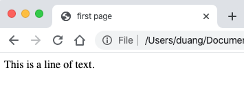

> The title element is important because it describes the page and is used by search engines.

### Creating a Blog

(Maybe later, no time to learn CSS now)

## HTML Basics

### Paragraphs

`<p></p>`: paragraph

`<br />`: line break (no end tag)

```html
<html>
    <head>
        <title>first page</title>
    </head>
    <body>
        This is a line of text.
        <p>This a paragraph.</p>
        <p>This is another paragraph.</p>
        <p>This is <br /> a line break </p>
    </body>
</html>
```

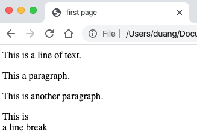

### Text Formatting

```html
<html>
    <head>
        <title>first page</title>
    </head>
    <body>
        <p>This is regular text</p>
        <p><b>bold text</b></p>
        <p><big>big text</big></p>
        <p><i>italic text</i></p>
        <p><small>small text</small></p>
        <p><strong>strong text</strong></p>
        <p><sub>subscripted text</sub></p>
        <p><sup>superscripted text</sup></p>
        <p><ins>inserted text</ins></p>
        <p><del>deleted text</del></p>
    </body>
</html>
```

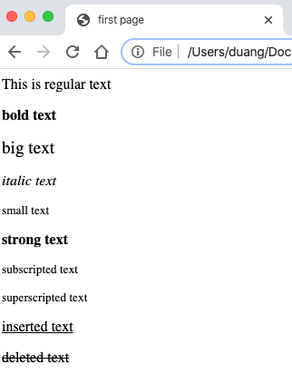

> Browsers display `<strong>` as `<b>`, and `<em>` as `<i>`.
> However, the meanings of these tags differ: `<b>` and `<i>` define bold and italic text, respectively, while `<strong>` and `<em>` indicate that the text is "**important**".

### Headings, Lines, Comments

from `<h1>` to `<h6`: six levels of headings

`<hr />`: a horizontal line (in HTML5, the `<hr>` tag defines a thematic break)

`<!-- some comments -->`: comments (the exclamation point (!) is only in the opening tag, but not in the closing tag)

```html
<html>
    <head>
        <title>first page</title>
    </head>
    <body>
        <h1>This is heading 1</h1>
        <h2>This is heading 2</h1>
        <h3>This is heading 3</h3>
        <h4>This is heading 4</h4>
        <h5>This is heading 5</h5>
        <h6>This is heading 6</h6>
        <p> This is a paragraph </p>
        <hr />
        <!-- Here are some comments. -->
        <p> This is another paragraph </p>
    </body>
</html>
```


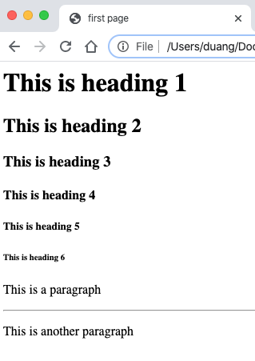

### Elements

An HTML element is written using a **start tag** and an **end tag** (some elements don't have an end tag, and with the **content** in between.

HTML documents consist of nested HTML elements.

### Attributes

Attributes provide **additional information** about an element or a tag, while also **modifying** them. Most attributes have a value; the value modifies the attribute.

```html
<html>
    <head>
        <title>first page</title>
    </head>
    <body>
        <p align="center">This is a text <br />
            <hr width="10%" align="right" /> This is also a text.
        </p>
    </body>
</html>
```


> The `align` attribute of `<p>` is not supported in HTML5.

### Images

```html
<html>
    <head>
        <title>first page</title>
    </head>
    <body>
        
        <!-- or -->
        
    </body>
</html>
```

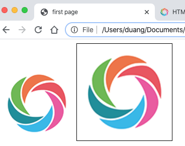

> The alt attribute specifies an alternate text for an image. In case the image cannot be displayed, the alt attribute specifies an alternate text that describes the image in words. The alt attribute is **required**.
>
> Loading images takes time. Using large images can slow down your page, so use them with care.
>
> By default, Internet Explorer 9, and its earlier versions, display a border around an image unless a border attribute is defined.

### Links

```html
<html>
    <head>
        <title>first page</title>
    </head>
    <body>
        <a href="http://www.sololearn.com"> Learn Playing </a>
        <!-- or open in a new window or new tab -->
        <p><a href="http://www.sololearn.com" target="_blank"> Learn Playing </a></p>
    </body>
</html>
```

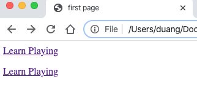

> To link an image to another document, simply nest the `` tag inside `<a>` tags.
>
> Links can be either absolute or relative.
>
> A visited link is underlined and purple.

### Lists

```html
<html>
    <head>
        <title>first page</title>
    </head>
    <body>
        <ol>
            <li>Red</li>
            <li>Blue</li>
            <li>Green</li>
        </ol>
        <ul>
            <li>Red</li>
            <li>Blue</li>
            <li>Green</li>
        </ul>
    </body>
</html>
```

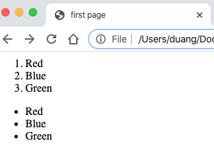

### Tables

Tables are defined by using the **`<table>`** tag.
Tables are divided into table rows with the **`<tr>`** tag.
Table rows are divided into table columns (table data) with the **`<td>`** tag.

```html
<html>
    <head>
        <title>first page</title>
    </head>
    <body>
        <table border="2" align="center">
            <tr>
                <td bgcolor="red">Red</td>
                <td bgcolor="blue">Blue</td>
                <td bgcolor="green">Green</td bgcolor="blue">
            </tr>
            <tr>
                <td bgcolor="yellow">Yellow</td>
                <td colspan="2" bgcolor="orange">Orange</td>
            </tr>
            <tr bgcolor="pink">
                <td colspan="3">Pink</td>
            </tr>
        </table>
    </body>
</html>
```

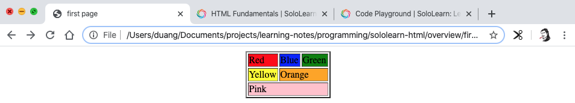

> Table data tags `<td>` act as data containers within the table.
> They can contain all sorts of HTML elements, such as text, images, lists, other tables, and so on.
>
> In the case of styling elements, CSS is more effective than HTML.

### Inline adn Block Elements

In HTML, most elements are defined as **block level** or **inline** elements. Block level elements *start from a new line*. Inline elements are normally *displayed without line breaks*.

**block level elements**: `<h1>`, `<form>`, `<li>`, `<ol>`, `<ul>`, `<p>`, <pre>, `<table>`, `<div>`, etc.

**inline elements**: `<b>`, `<a>`, `<strong>`, ``, `<input>`, `<em>`, `<span>`, etc.

The **`<div>`** element is a block-level element that is often used as a **container for other HTML elements**. When used together with some CSS styling, the `<div>` element can be used to style blocks of content.

Similarly, the **`<span>`** element is an inline element that is often used as a container for some text.
When used together with CSS, the `<span>` element can be used to style **parts of the text**.

```html
<html>
    <head>
        <title>first page</title>
    </head>
    <body>
        <h1>Headline</h1>
        <div style="background-color:green; color:white; padding:20px;">
            <p>Some paragraph text goes there.</p>
            <p>Another paragraph goes there.</p>
        </div>
        <h2>Some
            <span style="color:red">Important</span>
            Message
        </h2>
    </body>
</html>
```

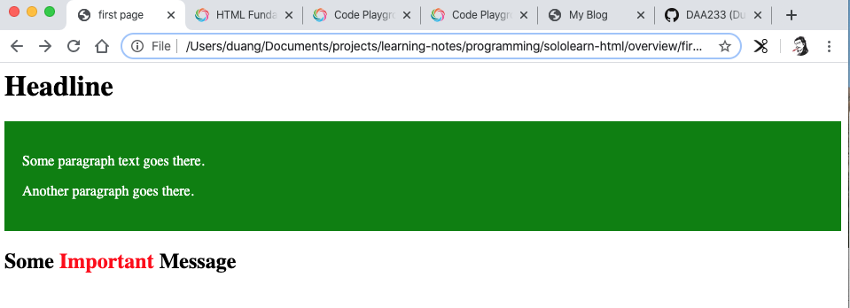

> **Summary**
> The `<div>` element defines a **block-level** section in a document.
> The `<span>` element defines an **inline** section in a document.
>
> You can insert inline elements inside block elements but you can't insert block elements inside inline elements.

Other elements can be used either as block level elements or inline elements. This includes the following elements:
**APPLET** - embedded Java applet
**IFRAME** - Inline frame
**INS** - inserted text
**MAP** - image map
**OBJECT** - embedded object
**SCRIPT** - script within an HTML document

### Forms

HTML forms (`<form>`) are used to collect information from the user.

Use the `action` attribute to point to a webpage that will load after the user submits the form.

> Usually the form is submitted to a web page on a web server.

The `method` attribute specifies the HTTP method (**GET** or **POST**) to be used when forms are submitted.

```html
<form action="url" method="GET">
```

```html
<form action="url" method="POST">
```

> When you use **GET**, the form data will be visible in the page address.
>
> Use **POST** if the form is updating data, or includes sensitive information (passwords).
> POST offers better security because the submitted data is not visible in the page address.

To take in user input, you need the corresponding form elements. You can use the variations of `<input>` to collect user input:

- `text`
- `password`
- `radio`
- `checkbox`
- `URL`
- `submit`
- etc

> The name attribute specifies a name for a form.

Use `<textarea>` to define multiline input control.

```html
<html>
    <head>
        <title>first page</title>
    </head>
    <body>
        <form name="text">
            <label>Username</label>
            <input type="text" placeholder="your name here" name="username" /><br />
            <label>Password</label>
            <input type="password" placeholder="your password here" name="password" />
        </form>
        <form name="radio">
            <input type="radio" name="gender" /> Male <br />
            <input type="radio" name="gender" /> Female <br />
        </form>
        <form name="checkbox">
            <input type="checkbox" name="profession" /> Student <br />
            <input type="checkbox" name="profession" /> Programmer <br />
        </form>
        <p></p>
        <form name="sololearn" action="https://www.sololearn.com/">
            <input type="submit" value="open sololearn" />
        </form>
        <form name="baidu" action="https://www.baidu.com/s" target="_blank" method="GET">
            Search anything here:<br />
            <textarea name="wd"></textarea><br />
            <input type="submit" value="Search" />
        </form>
        <form name="baidu" action="https://www.baidu.com/s" target="_blank" method="GET">
            Search anything here with secret words:<br />
            <input type="password" name="wd" />
            <input type="submit" value="Search" /><br />
            <small>However, you will see your words in the address line...</small>
        </form>
    </body>
</html>
```

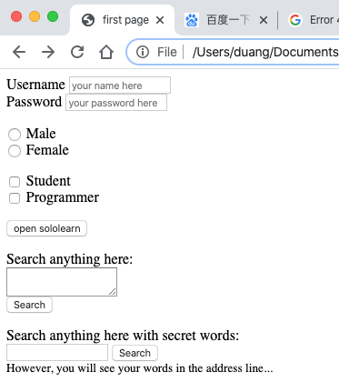

### HTML Colors

HTML colors are expressed as hexadecimal values: **0, 1, 2, 3, 4, 5, 6, 7, 8, 9, A, B, C, D, E, F**

Colors are displayed in combinations of **red**, **green**, and **blue** light (**RGB**). RGB color values are supported in all browsers.

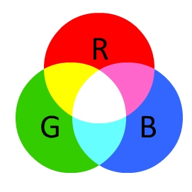

Hex values are written using the hashtag symbol (**#**), followed by either three or six hex characters.

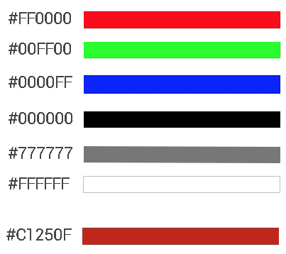

The `bgcolor` attribute can be used to change the web page's background color.

The color attribute specifies the color of the text inside a `<font>` element.

```html
<html>
    <head>
        <title>first page</title>
    </head>
    <body bgcolor="#000099">
        <h1>
            <font color="#FFFFFF"> White headline</font>
        </h1>
    </body>
</html>
```


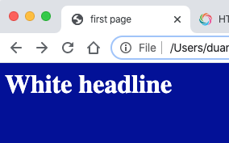

### Frames

A page can be divided into frames using a special frame document.

The **`<frame>`** tag defines one specific window (frame) within a **`<frameset>`**. Each `<frame>` in a `<frameset>` can have different attributes, such as border, scrolling, the ability to resize, etc.

The `<frameset>` element specifies the number of columns or rows in the frameset, as well as what percentage or number of pixels of space each of them occupies.

Use the `noresize` attribute to specify that a user cannot resize a `<frame>` element.

Frame content should be defined using the `src` attribute.

Lastly, the **`<noframes>`** element provides a way for browsers that do not support frames to view the page. The element can contain an alternative page, complete with a body tag and any other elements.The `<frameset>` tag is not supported in HTML5.

```html
<!-- first.html -->
<html>
    <head>
        <title>first page</title>
    </head>

    <!-- It displays nothing when putting frameset inside body -->
    <frameset cols="25%,*,25%">
        <frame src="frame_a.htm" noresize="noresize">
        <frame src="frame_b.htm">
        <frame src="frame_c.htm">
    </frameset>
    
    <body></body>

</html>
```

```html
<!-- frame_a.htm -->
<html>
    <head>Frame A</head>
    <body bgcolor="red", noresize="noresize">
        The content of frame A
    </body>
</html>
```

```html
<!-- frame_b.htm -->
<html>
    <head>Frame B</head>
    <body>
        The content of frame B
    </body>
</html>
```

```html
<!-- frame_c.html -->
The content of frame C
```

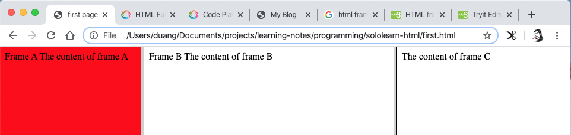

>  The `<frameset>`, `<frame>` and `<noframes>` are not supported in HTML5.

Use `<iframe>` to define inline frames:

```html
<html>
    <head>
        <title>first page</title>
    </head>
    <body>
        <h1><span>My Media</span></h1>
        <iframe hegiht="150" width="300" src="https://www.youtube.com/embed/Q6_5InVJZ88" 
            allowfullscreen frameborder="0"></iframe>
    </body>
</html>
```


## HTML5

### Introduction to HTML5

When writing HTML5 documents, one of the first new features that you'll notice is the doc type declaration:

```html
<!DOCTYPE HTML> 
```

The character encoding (charset) declaration is also simplified:

```html
<meta charset="UTF-8">
```

> The default character encoding in HTML5 is UTF-8.

#### New in HTML5
##### **More elements**
```text
<article>, <aside>, <audio>, <canvas>, <datalist>, <details>, <embed>, <footer>, <header>, <nav>, <output>, <progress>, <section>, <video>...
```

**Forms**

- The Web Forms 2.0 specification allows for creation of more powerful forms and more compelling user experiences.
- Date pickers, color pickers, and numeric stepper controls have been added.
- Input field types now include email, search, and URL.
- PUT and DELETE form methods are now supported.

**Integrated API** (Application Programming Interfaces)

- Drag and Drop
- Audio and Video
- Offline Web Applications
- History
- Local Storage
- Geolocation
- Web Messaging

### Content Models

In HTML, elements typically belonged in either the block level or inline content model. HTML5 introduces **seven** main content models to make the markup structure more meaningful for both the browser and the web designer:

- **Metadata**: Content that sets up the presentation or behavior of the rest of the content. These elements are found in the **head** of the document.

  Elements: `<base>, <link>, <meta>, <noscript>, <script>, <style>, <title>`

- **Embedded**: Content that imports other resources into the document.

  Elements: `<audio>, <video>, <canvas>, <iframe>, , <math>, <object>, <svg>`

- **Interactive**: Content specifically intended for user interaction.

  Elements: `<a>, <audio>, <video>, <button>, <details>, <embed>, <iframe>, , <input>, <label>, <object>, <select>, <textarea>`

- **Heading**: Defines a section header.

  Elements: `<h1>, <h2>, <h3>, <h4>, <h5>, <h6>, <hgroup>`

- **Phrasing**: This model has a number of inline level elements in common with HTML4.

  Elements: `, <span>, <strong>, <label>, <br />, <small>, <sub>`, and more.

- **Flow**: Contains the majority of HTML5 elements (almost all of the others) that would be included in the normal flow of the document.

- **Sectioning**: Defines the scope of headings, content, navigation, and footers.

  Elements: `<article>, <aside>, <nav>, <section>`

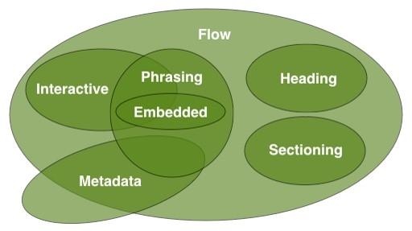

> The same element can belong to more than one content model.
>
> The various content models overlap in certain areas, depending on how they are being used.

### HTML5 Page Structure

A generic HTML5 page structure looks like this:

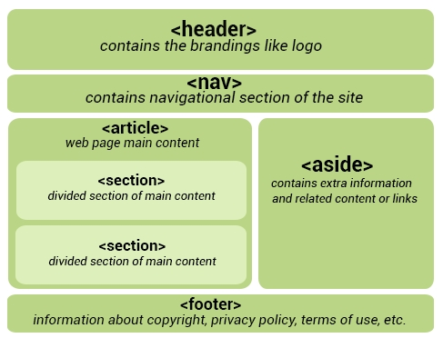

### header, nav & footer

#### header

In HTML4, we would define a header like this:

```html
<div id="header">
```

In HTML5, a simple **`<header>`** tag is used (also in the body tag), instead.

Note that the `<header>` is completely different from the `<head>` tag.

#### footer

The footer element is also widely used at the very bottom of the web page.

```html
<footer>...</footer>
```

The following information is usually provided between these tags:
- Contact Information
- Privacy Policy
- Social Media Icons
- Terms of Service
- Copyright Information
- Sitemap and Related Documents

#### nav

 This tag represents a section of a page that links to other pages or to certain sections within the page.

```html
<nav>
   <ul>
      <li><a href="#">Home</a></li>
      <li><a href="#">Services</a></li>
      <li><a href="#">About us</a></li>
   </ul>
</nav>
```

> Not all of the links in a document should be inside a `<nav>` element. The `<nav>` element is intended only for major blocks of navigation links. Typically, the `<footer>` element often has a list of links that don't need to be in a `<nav>` element.

### article, section & aside

#### article

**Article** is a self-contained, independent piece of content that can be used and distributed separately from the rest of the page or site. This could be a forum post, a magazine or newspaper article, a blog entry, a comment, an interactive widget or gadget, or any other independent piece of content.

The `<article>` element replaces the `<div>` element that was widely used in HTML4, along with an id or class.

```html
<article> 
   <h1>The article title</h1> 
   <p>Contents of the article element </p>
</article>
```

> When an `<article>` element is nested, the inner element represents an article related to the outer element. For example, blog post comments can be `<article>` elements nested in the `<article>` representing the blog post.

#### section

**`<section>`** is a logical container of the page or article. Sections can be used to divide up content within an article.

It can also be used outside of the `<article>`.

```html
<article>
   <h1>Welcome</h1>
   <section>
      <!-- diffrent size h1 from above -->
      <h1>Heading</h1>
      <p>content or image</p>
   </section>
</article>
```

#### aside

**`<aside>`** is secondary or tangential content which could be considered separate from but indirectly related to the main content.

This type of content is often represented in sidebars.

```html
<article>
   <h1> Gifts for everyone </h1>
   <p> This website will be the best place for choosing gifts </p>
   <aside>
      <p> Gifts will be delivered to you within 24 hours </p>
   </aside>
</article>
```

Demo code:

```html
<!DOCTYPE html>
<html>
    <head></head>
    <body>
        <header>
            <h1>Most important heading</h1>
            <h3>Less important heading</h3>
        </header>
        <article>
            <h1>Welcome</h1>
            <section>
               <h1>Heading</h1>
               <p>content or image</p>
            </section>
            <section>
                <h1>Gifts for everyone</h1>
                <p>This website will be the best place for choosing gifts</p>
                <aside>
                    <p>Gifts will be delivered to you within 24 hours</p>
                </aside>
            </section>
         </article>
    </body>
</html>
```

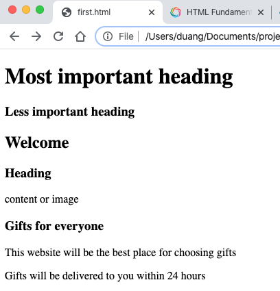

> @Mario Fuentes: When you run the html file the `<aside>` tag just looks like a different paragraph `<p> `can someone please clarify why this is important... 
>
> @Ltzu: I think, that's important for search engines - they have to be able to seperate main content and less important content
>
> @Ryan Purcell: In addition to what Ltzu said (which is probably the most likely use of `<aside>`), it also is useful for webpage reading applications like Clearly by Evernote. Those apps can strip out "extra" content to make things clearer for the user to read.

### audio

Before HTML5, there was no standard for playing audio files on a web page.
The HTML5 `<audio>` element specifies a standard for embedding audio in a web page.

There are two different ways to specify the audio source file's URL. The first uses the `source` attribute:

```html
<audio src="audio.mp3" controls>
    Audio element not supported by your browser.
</audio>
```

The second way uses the `<source>` element inside the `<audio>` element:

```html
<audio controls>
    <source src="audio.mp3" type="audio/mpeg">
    <source src="audio.ogg" type="audio/ogg">
    Audio element not supported by your browser. 
</audio>
```

> Multiple `<source>` elements can be linked to different audio files. The browser will use **the first** recognized format.
>
> The text between the `<audio>` and `</audio>` tags will display in browsers that do not support the `<audio>` element.
>
> Currently, there are three supported file formats for the `<audio>` element: MP3, WAV, and OGG.

**controls**: specifies that audio controls should be displayed (such as a play/pause button, etc.)

**autoplay**: starts playing as soon as it is ready, without asking for the visitor's permission. It is not permitted by default in Chrome but is in Safari.

**loop**: replay every time it is finished.

```html
<audio controls autoplay loop>
    <source src="http://www.sololearn.com/uploads/audio.mp3" type="audio/mpeg">
    <source src="http://www.sololearn.com/uploads/audio.ogg" type="audio/ogg">
    Audio element not supported by your browser. 
</audio>
```

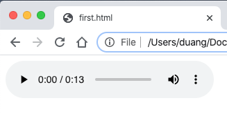

### video

Just like `<audio>`:

```html
<video controls autoplay loop>
    <source src="http://www.sololearn.com/uploads/video.mp4" type="video/mp4">
    <source src="http://www.sololearn.com/uploads/video.ogg" type="video/ogg">
    Video is not supported by your browser.
</audio>
```

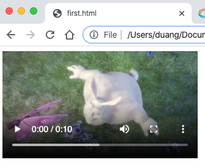

> Currently, there are three supported video formats for the `<video>` element: MP4, WebM, and OGG.

### progress

The **`<progress>`** element provides the ability to create progress bars on the web and can be used within headings, paragraphs, or anywhere else in the body.

**Value**: Specifies how much of the task has been completed.
**Max**: Specifies how much work the task requires in total.

```html
Status: <progress min="0" max="100" value="60">
</progress>
```

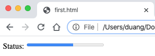

Also have a try to not set `value`. :happy:

Use the `<progress>` tag in conjunction with JavaScript to dynamically display a task's progress.

```html
Status: <progress min="0" max="100" value="60" id="bar">
</progress>

<!-- JS script by @patryk -->
<script>
    window.onload = function () {
        var val = 0
        var t = setInterval(progress, 50);
        function progress() {
            if (val == 100) {
                clearInterval(t);
            }
            else {
                val++;
                document.getElementById("bar").value = val;
            }
        }
    }
</script>
```


### Web Storage API

With HTML5 web storage, websites can store data on a user's local computer.
Before HTML5, we had to use **JavaScript cookies** to achieve this functionality.

**The Advantages of Web Storage**
- More secure
- Faster
- Stores a larger amount of data
- Stored data is not sent with every server request

> Local storage is per domain. All pages from one domain can store and access the same data.

There are two types of web storage objects:

- **sessionStorage()**: destroyed once the user closes the browser
- **localStorage()**: stores data with no expiration date

> You need to be familiar with basic JavaScript in order to understand and use the API.

The syntax for web storage for both local and session storage is very simple and similar.
The data is stored as key/value pairs.

```html
<script>
    // storing a value
    localStorage.setItem("key1", "value1");

    // gettting a value (this will print the value)
    alert(localStorage.getItem("key1"));

    // removing a value
    localStorage.removeItem("key1");

    // removing all values
    localStorage.clear();
</script>
```

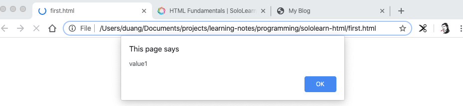

### Geolocation API

In HTML5, the Geolocation API is used to obtain the user's geographical location.

Since this can compromise user privacy, the option is not available unless the user approves it.

> Geolocation is much more accurate for devices with GPS, like smartphones and the like.

```js
navigator.geolocation.getCurrentPosition();
```

Parameters:
**showLocation (mandatory)**: Defines the callback method that retrieves location information.
**ErrorHandler(optional)**: Defines the callback method that is invoked when an error occurs in processing the asynchronous call.
**Options (optional)**: Defines a set of options for retrieving the location information.

```html
<!-- code by Luis Eduardo López Andrade -->
<!DOCTYPE html>
<html>

<body>
    <p>Click the button to get your coordinates.</p>
    <button onclick="getLocation()">Try It</button>
    <p id="demo"></p>

    <script>
        var x = document.getElementById("demo");

        function getLocation() {
            if (navigator.geolocation) {
                navigator.geolocation.getCurrentPosition(showPosition);
            } else {
                x.innerHTML = "Geolocation is not supported by this browser.";
            }
        }

        function showPosition(position) {
            x.innerHTML = "Latitude: " + position.coords.latitude +
                "<br>Longitude: " + position.coords.longitude;
        }
    </script>

</body>

</html>
```

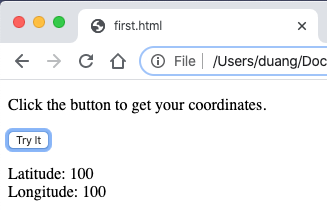

User location can be presented in two ways: **Geodetic** and **Civic**.

1. The geodetic way to describe position refers directly to latitude and longitude.
2. The civic representation of location data is presented in a format that is more easily read and understood by the average person.

Each parameter has both a geodetic and a civic representation:

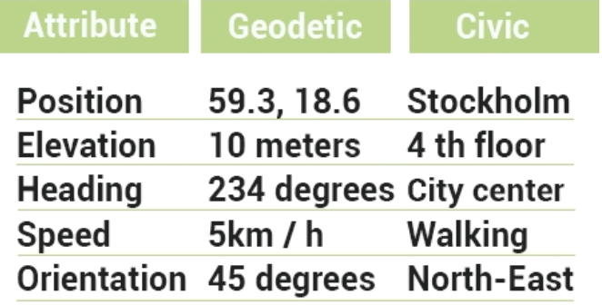

> The `getCurrentPosition()` method returns an object if it is successful. The latitude, longitude, and accuracy properties are always returned.

### Drag&Drop API

The drag and drop feature lets you "grab" an object and drag it to a different location.

```html

```

> Any HTML element can be draggable.

The API for HTML5 drag and drop is event-based.

Example:

```html
<!DOCTYPE HTML>
<html>

<head>
    <script>
        function allowDrop(ev) {
            // prevents the browser's default handling of the data
            ev.preventDefault();
        }

        function drag(ev) {
            ev.dataTransfer.setData("text", ev.target.id);
        }

        function drop(ev) {
            // prevents the browser's default handling of the data
            // (default is open as link on drop).
            ev.preventDefault();
            var data = ev.dataTransfer.getData("text");
            ev.target.appendChild(document.getElementById(data));
        }
    </script>
</head>

<body>

    <div id="box" ondrop="drop(event)" ondragover="allowDrop(event)" style="border:1px solid black; 
   width:200px; height:200px"></div>

    

</body>

</html>
```


**What to Drag**

When the element is dragged, the **ondragstart** attribute calls a function, drag(event), which specifies what data is to be dragged.

The **dataTransfer.setData()** method sets the data type and the value of the dragged data:

```javascript
function drag(ev) {
    ev.dataTransfer.setData("text", ev.target.id);
}
```

**Where to Drop**
The **ondragover** event specifies where the dragged data can be dropped. By default, data and elements cannot be dropped in other elements. To allow a drop, we must prevent the default handling of the element.
This is done by calling the `event.preventDefault()` method for the **ondragover** event.

**Do the Drop**
When the dragged data is dropped, a drop event occurs.
In the example above, the **ondrop** attribute calls a function, drop(event):

```javascript
function drop(ev) {
    ev.preventDefault();
    var data = ev.dataTransfer.getData("text");
    ev.target.appendChild(document.getElementById(data));
}
```

The dragged data can be accessed with the **dataTransfer.getData()** method. This method will return any data that was set to the same type in the `setData()` method.
The dragged data is the ID of the dragged element ("image").

At the end, the dragged element is appended into the drop element, using the `appendChild()` function.

### SVG

**SVG** stands for **S**calable **V**ector **G**raphics, and is used to draw shapes with HTML-style markup.

It offers several methods for drawing paths, boxes, circles, text, and graphic images.

> SVG is not pixel-based, so it can be magnified infinitely with no loss of quality.
>
> SVG defines vector-based graphics in XML format.

#### Drawing shapes

**Circle**

```html
<svg width="1000", height="1000">
    <circle cx="80" cy="80" r="50" fill="green" />
</svg>
```

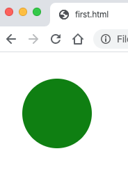

- **cx** pushes the center of the circle further to the right of the screen
- **cy** pushes the center of the circle further down from the top of the screen
- **r** defines the radius
- **fill** determines the color of our circle
- **stroke** adds an outline to the circle

**Rect**

```html
<svg width="1000", height="1000">
    <rect width="300" height="100" x="20" y="20" fill="green" />
</svg>
```

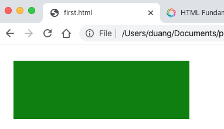

**Line segment**

```html
<svg width="1000", height="1000">
    <line x1="10" y1="10" x2="200" y2="100"
        style="stroke:#000000; stroke-linecap: round; stroke-width: 20;" />
    <polyline style="stroke-linejoin:miter; stroke:black;
        stroke-width: 12; fill: none;"
        points="200 200, 150 150, 100 200" />
</svg>
```

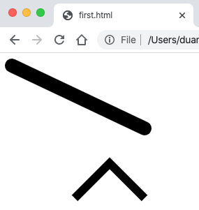

**Ellipse**

```html
<svg width="1000", height="1000">
    <ellipse cx="200" cy="100" rx="150" ry="70" style="fill:green" />
</svg>
```

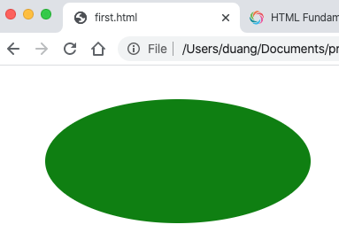

**Polygon**

```html
<svg width="1000", height="1000">
    <polygon points="100 100, 200 200, 300 0"
        style="fill:green; stroke:black" />
</svg>
```

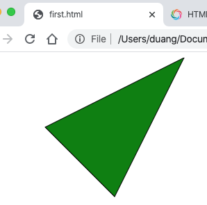

> Polygon comes from Greek. "Poly" means "many" and "gon" means "angle."

### SVG Animations & Paths

#### Shape Animations

SVG animations can be created using the **`<animate>`** element.

```html
<svg width="1000", height="250">
    <rect width="150" height="150" fill="orange">
        <animate attributeName="x" from="0" to="300"
            dur="1s" fill="freeze" repeatCount="2" />
    </rect>
</svg>
```


**attributeName**: Specifies which attribute will be affected by the animation
**from**: Specifies the starting value of the attribute
**to**: Specifies the ending value of the attribute
**dur**: Specifies how long the animation runs (duration)
**fill**: Specifies whether or not the attribute's value should return to its initial value when the animation is finished (Values: "remove" resets the value; "freeze" keeps the “to value”)
**repeatCount**: Specifies the repeat count of the animation. Use the value "**indefinite**" to repeat indefinitely.

#### Paths

The `<path>` element is used to define a path.

The following commands are available for path data:
**M**: moveto
**L**: lineto
**H**: horizontal lineto
**V:** vertical lineto
**C**: curveto
**S**: smooth curveto
**Q**: quadratic Bézier curve
**T**: smooth quadratic Bézier curveto
**A:** elliptical Arc
**Z**: closepath

> All of the above commands can also be expressed with lower case letters. When capital letters are used, it indicates absolute position; lower case indicates relative position.

Define a path using the **d** attribute:

```html
<svg width="500" height="500">
    <path d="M 0 0 L 200 200 L 200 0 Z" style="stroke:#000; fill:none;" />
</svg>
```

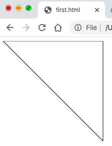

### Canvas

The HTML canvas is used to draw graphics that include everything from simple lines to complex graphic objects.

```html
<canvas id="canvas1" width="200" height="100">
</canvas>
```

> The `<canvas>` element is only a container for graphics. You must use a script to actually draw the graphics (usually JavaScript).

The `<canvas>` element must have an **id attribute** so it can be referred to by JavaScript:

```html
<html>
    <head></head>
    <body>
        <canvas id="canvas1" width="400" height="300"></canvas>
        <script>
            var can = document.getElementById("canvas1");
            var ctx = can.getContext("2d");
            // draw a green rectangle
            ctx.fillStyle="rgba(0, 200, 0, 1)";
            ctx.fillRect(30, 25, 50, 50);
            // draw a line
            ctx.lineWidth="2";
            ctx.strokeStyle="rgba(100, 100, 200, 1)";
            ctx.moveTo(50, 100);
            ctx.lineTo(100, 150);
            ctx.stroke();
            // draw a circle
            ctx.beginPath();
            ctx.arc(150, 50, 30, 0, 360)
            ctx.stroke();
            // draw filled text
            ctx.fillText("圆", 145, 55);
            // draw stroke text
            ctx.strokeText("方", 50, 50)
        </script>
    </body>
</html>
```

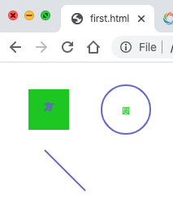

For drawing gradients, refer to [this example](https://code.sololearn.com/W6WLbiZ9bqKF/#html) by @Fernando Eufrásio.

### Canvas vs. SVG

**Canvas**
- Elements are drawn programmatically
- Drawing is done with pixels
- Animations are not built in
- High performance for pixels-based drawing operations
- Resolution dependent
- No support for event handlers
- You can save the resulting image as .png or .jpg
- Well suited for graphic-intensive games

**SVG**
- Elements are part of the page's DOM (Document object model)
- Drawing is done with vectors
- Effects, such as animations are built in
- Based on standard XML syntax, which provides better accessibility
- Resolution independent
- Support for event handlers
- Not suited for game applications
- Best suited for applications with large rendering areas (for example, Google Maps)

### Canvas Transformations

The Canvas element can be transformed.

```html
<html>

<head></head>

<body>
    <canvas id="canvas1" width="400" height="300"></canvas>
    <script>
        var can = document.getElementById("canvas1");
        var ctx = can.getContext("2d");
        ctx.font = "bold 22px Tahoma";
        ctx.textAlign = "start";
        ctx.fillText("start", 10, 30);
        // move the canvas 50px to the right, and 100px down
        ctx.translate(50, 100);
        ctx.fillText("after translate", 0, 0);
        // rotate the canvas 30 degrees
        // the param of rotate() must be in radians, not degrees.
        ctx.rotate((Math.PI / 180) * 30);
        ctx.fillText("after rotate", 20, 20);
        // scale the canvas, X: 1.5 times, Y: 4times
        // all future drawings will be scaled
        ctx.scale(1.5, 4);
        ctx.fillText("after scale", 25, 25)
    </script>
</body>

</html>
```

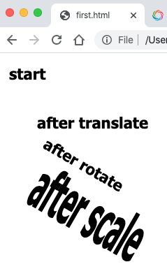

> Canvas has several methods for drawing paths, boxes, circles, text, and adding images.

### HTML5 Forms

HTML5 brings many features and improvements to web form creation. There are new attributes and input types that were introduced to help create better experiences for web users.

Form creation is done in HTML5 the same way as it was in HTML4.

On `<input>` and `<textarea>` elements, **placeholder** attribute provides a hint to the user of what information can be entered into the field.

The **autofocus** attribute makes the desired input focus when the form loads.

The "**required**" attribute is used to make the input elements required.

The **autocomplete** attribute specifies whether a form or input field should have autocomplete turned on or off.

```html
<html>

<head></head>

<body>
    <form autocomplete="off">
        <label for="email">Your e-mail address: </label>
        <input type="text" name="email" placeholder="xxx@xxx.com" autofocus required />
        <input type="submit" name="submit" value="submit" />
    </form>
</body>

</html>
```

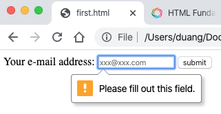

The new **search** input type can be used to create a search box.

The **`<datalist>`** tag can be used to define a list of pre-defined options for the search field or the text field. **`<option>`** defines the options in a drop-down list for the user to select.

```html
<html>

<head></head>

<body>
    <form autocomplete="off">
        <input id="mysearch" name="searchitem" type="search" list="colors" />
        <datalist id="colors">
            <option value="Red">
            <option value="Green">
            <option value="Yellow">
        </datalist>
    </form>
</body>

</html>
```

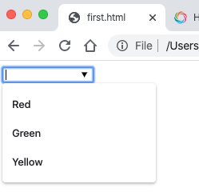

> The ID of the datalist element must match with the list attribute of the input box.

Some other new input types include **email**, **url**, and **tel**:

```html
<html>

<head></head>

<body>
    <form autocomplete="off">
        <input id="email" name="email" type="email" placeholder="example@example.com" />
        <br />
        <input id="url" name="url" type="url" placeholder="example.com" />
        <br />
        <input id="tel" name="tel" type="tel" placeholder="555.555.1211" />
        <br />
        <p></p>
        <input id="submit" name="submit" type="submit" value="submit" />
    </form>
</body>

</html>
```

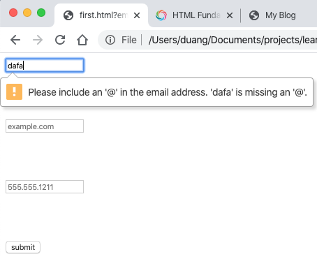

> Use the `novalidate` attribute to avoid form validation on submissions.

These new types make it easier to structure and validate HTML forms.


**HTML5 added several new input types:**

- color
- date
- datetime
- datetime-local
- email
- month
- number
- range
- search
- tel
- time
- url
- week

**New input attributes in HTML5:**
- autofocus
- form
- formaction
- formenctype
- formmethod
- formnovalidate
- formtarget
- height and width
- list
- min and max
- multiple
- pattern (regexp)
- placeholder
- required
- step

