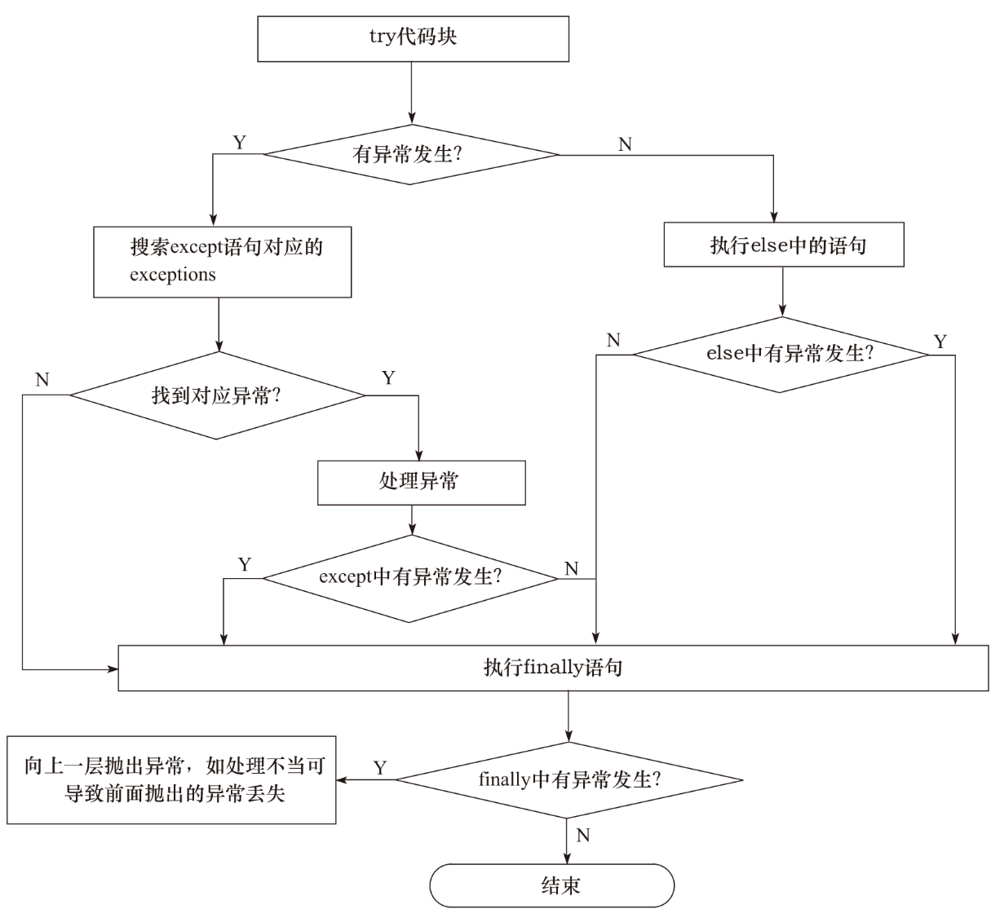

# 编写高质量代码：改善 Python 程序的91个建议

## 第1章 引论

### 建议1. 理解 Pythonic 概念

```shell
$ python -c "import this"
The Zen of Python, by Tim Peters

Beautiful is better than ugly.
Explicit is better than implicit.
Simple is better than complex.
Complex is better than complicated.
Flat is better than nested.
Sparse is better than dense.
Readability counts.
Special cases aren't special enough to break the rules.
Although practicality beats purity.
Errors should never pass silently.
Unless explicitly silenced.
In the face of ambiguity, refuse the temptation to guess.
There should be one-- and preferably only one --obvious way to do it.
Although that way may not be obvious at first unless you're Dutch.
Now is better than never.
Although never is often better than *right* now.
If the implementation is hard to explain, it's a bad idea.
If the implementation is easy to explain, it may be a good idea.
Namespaces are one honking great idea -- let's do more of those!
```

（1）Pythonic 的定义

充分体现 Python 自身特色，看起来像是伪代码。

（2）代码风格

充分利用 Python 语法，但不应当过分地使用奇技淫巧。

（3）标准库

写Pythonic程序需要对标准库有充分的理解，特别是内置函数和内置数据类型。

（4）Pythonic的库或框架

程序员利用Pythonic的库或框架能更加容易、更加自然地完成任务。如果用Python编写的库或框架迫使程序员编写累赘的或不推荐的代码，那么可以说它并不Pythonic。现在业内通常认为Flask这个框架是比较Pythonic的。

### 建议2：编写 Pythonic 代码

（1）要避免劣化代码

与优化代码对应，劣化代码就是一开始写出来就是不合理的代码，比如不合适的变量命名等。

​	1）避免只用大小写来区分不同的对象。

​	2）避免使用容易引起混淆的名称。

​	3）不要害怕过长的变量名。

（2）深入认识Python有助于编写Pythonic代码

	- 全面掌握Python提供给我们的所有特性，包括语言特性和库特性。其中最好的学习方式应该是通读官方手册中的Language Reference和Library Reference。
	- 学习每个Python新版本提供的新特性，以及掌握它的变化趋势。
	- 深入学习业界公认的比较Pythonic的代码，比如Flask、gevent和requests等。
	- 尝试利用工具达到事半功倍的效果。如使用 `pep8` 检查代码是否符合PEP8规范：`pep8 --first demo.py`。

### 建议3：理解Python与C语言的不同之处

（1）“缩进”与“{}”

与C、C++、Java等语言使用花括号{}来分隔代码段不同，Python中使用严格的代码缩进方式分隔代码块。统一缩进风格，不要混用 Tab 和空格。

（2）`'`与`"`

C语言中单引号（'）与双引号（"）有严格的区别，单引号代表一个字符，它实际对应于编译器所采用的字符集中的一个整数值。但在Python中，单引号与双引号没有明显区别，仅仅在输入字符串内容不同时，在使用上存在微小差异。

（3）三元操作符“?:”

三元操作符是if...else的简写方法，语法形式为C ? X: Y，它表示当条件C为True的时候取值X，C为False的时候取值为Y。

```python
In [7]: x = 1

In [8]: y = 2

In [9]: print(x if x < y else y)
1
```

（4）switch...case

在 Python 中优先用 if...elif...else 实现。下面的跳转表也可以实现：

```python
# 跳转表
In [3]: def f(x):
   ...:     return {
   ...:         0: "hello",
   ...:         1: "world"
   ...:     }.get(x, "not 0 or 1")
   ...:

In [4]: f(2)
Out[4]: 'not 0 or 1'

In [5]: f(1)
Out[5]: 'world'

In [6]: f(0)
Out[6]: 'hello'
```

### 建议4：在代码中适当添加注释

Python中有3种形式的代码注释：块注释、行注释以及文档注释（docstring）。

1）使用块或者行注释的时候仅仅注释那些复杂的操作、算法，还有可能别人难以理解的技巧或者不够一目了然的代码。

2）注释和代码隔开一定的距离，同时在块注释之后最好多留几行空白再写代码。

3）给外部可访问的函数和方法（无论是否简单）添加文档注释。注释要清楚地描述方法的功能，并对参数、返回值以及可能发生的异常进行说明，使得外部调用它的人员仅仅看docstring就能正确使用。

4）推荐在文件头中包含copyright申明、模块描述等，如有必要，可以考虑加入作者信息以及变更记录。

没有注释的代码通常会给他人的阅读和理解带来一定困难，即使是自己写的代码，过一段时间再回头阅读可能也需要一定时间才能理解当初的思路。

注释应该是用来解释代码的功能、原因以及想法的，而不是对代码本身的解释。

对于不再需要的代码，应该将其删除，而不是将其注释掉。即使你担心以后还会用到，版本控制工具也可以让你轻松找回被删除的代码。

### 建议5：通过适当添加空行使代码布局更为优雅、合理

布局清晰、整洁、优雅的代码能够给阅读它的人带来愉悦感，而且它能帮助开发者之间进行良好的沟通。在一个团队中，保持良好的代码格式需要团队成员在选取一套合适的代码格式规则的基础上遵从和应用。

1）在一组代码表达完一个完整的思路之后，应该用空白行进行间隔。如每个函数之间，导入声明、变量赋值等。

2）尽量保持上下文语义的易理解性。

3）避免过长的代码行，每行最好不要超过80个字符。

4）不要为了保持水平对齐而使用多余的空格，其实使阅读者尽可能容易地理解代码所要表达的意义更重要。

5）空格的使用要能够在需要强调的时候警示读者，在疏松关系的实体间起到分隔作用，而在具有紧密关系的时候不要使用空格。

### 建议6：编写函数的4个原则

函数能够带来最大化的代码重用和最小化的代码冗余。精心设计的函数不仅可以提高程序的健壮性，还可以增强可读性、减少维护成本。

原则1 函数设计要尽量短小，嵌套层次不宜过深。

原则2 函数申明应该做到合理、简单、易于使用。除了函数名能够正确反映其大体功能外，参数的设计也应该简洁明了，参数个数不宜太多。参数太多带来的弊端是：调用者需要花费更多的时间去理解每个参数的意思，测试人员需要花费更多的精力来设计测试用例，以确保参数的组合能够有合理的输出，这使覆盖测试的难度大大增加。

原则3　函数参数设计应该考虑向下兼容。实际工作中我们可能面临这样的情况：随着需求的变更和版本的升级，在前一个版本中设计的函数可能需要进行一定的修改才能满足这个版本的要求。因此在设计过程中除了着眼当前的需求还得考虑向下兼容。

原则4 一个函数只做一件事，尽量保证函数语句粒度的一致性。

Python中函数设计的好习惯还包括：不要在函数中定义可变对象作为默认值，使用异常替换返回错误，保证通过单元测试等。

### 建议7：将常量集中到一个文件

实际上Python的内建命名空间是支持一小部分常量的，如我们熟悉的True、False、None等，只是Python没有提供定义常量的直接方式而已。

```python
# Put in const.py...
# from http://code.activestate.com/recipes/65207-constants-in-python
class _const:
    class ConstError(TypeError): pass  # Base exception class.
    class ConstCaseError(ConstError): pass

    def __setattr__(self, name, value):
        if name in self.__dict__:
            raise self.ConstError("Can't change const.%s" % name)
        if not name.isupper():
            raise self.ConstCaseError('const name %r is not all uppercase' % name)
        self.__dict__[name] = value

# Replace module entry in sys.modules[__name__] with instance of _const
# (and create additional reference to it to prevent its deletion -- see
#  https://stackoverflow.com/questions/5365562/why-is-the-value-of-name-changing-after-assignment-to-sys-modules-name)
import sys
_ref, sys.modules[__name__] = sys.modules[__name__], _const()

import const

const.X = 1
const.Y = 2
const.Z = 3


# NOTE: To use const in other modules
# import const
# print(const.X, const.Y, const.Z)


if __name__ == '__main__':
    import __main__  as const  # Test this module...

    try:
        const.Answer = 42  # Not OK to create mixed-case attribute name.
    except const.ConstCaseError as exc:
        print(exc)
    else:  # Test failed - no ConstCaseError exception generated.
        raise RuntimeError("Mixed-case const names should't be allowed!")

    try:
        const.ANSWER = 42  # Should be OK, all uppercase.
    except Exception as exc:
        raise RuntimeError("Defining a valid const attribute should be allowed!")
    else:  # Test succeeded - no exception generated.
        print('const.ANSWER set to %d raised no exception' % const.ANSWER)

    try:
        const.ANSWER = 17  # Not OK, attempt to change defined constant.
    except const.ConstError as exc:
        print(exc)
    else:  # Test failed - no ConstError exception generated.
        raise RuntimeError("Shouldn't be able to change const attribute!")
```

这里涉及到了 Python 导包的问题，如何导入下划线开头的类或函数？

另一种做法，参考：https://www.programiz.com/python-programming/variables-constants-literals

## 第2章 编程惯用法

### 建议8 利用 assert 语句来发现问题

断言（assert）在很多语言中都存在，它主要为调试程序服务，能够快速方便地检查程序的异常或者发现不恰当的输入等，可防止意想不到的情况出现。

```python
assert expression ["," expression2]
```

加上-O的参数：`python -O asserttest.py` 便可以禁用断言。

断言实际是被设计用来捕获用户所定义的约束的，而不是用来捕获程序本身错误的。

1）不要滥用，这是使用断言最基本的原则。

2）如果Python本身的异常能够处理就不要再使用断言。

3）不要使用断言来检查用户的输入。

4）在函数调用后，当需要确认返回值是否合理时可以使用断言。

5）当条件是业务逻辑继续下去的先决条件时可以使用断言。

### 建议9：数据交换值的时候不推荐使用中间变量

```python
x, y = y, x
```

这种方式更加简洁、高效。

### 建议10：充分利用Lazy evaluation的特性

Lazy evaluation常被译为“延迟计算”或“惰性计算”，指的是仅仅在真正需要执行的时候才计算表达式的值。

1）避免不必要的计算，带来性能上的提升。

如果对于or条件表达式应该将值为真可能性较高的变量写在or的前面，而and则应该推后。

2）节省空间，使得无限循环的数据结构成为可能。Python中最典型的使用延迟计算的例子就是生成器表达式了，它仅在每次需要计算的时候才通过 `yield` 产生所需要的元素。斐波那契数列在Python中实现起来就显得相当简单，而while True也不会导致其他语言中所遇到的无限循环的问题。

```python
def fib():
    a, b = 0, 1
    while True:
        yield a
        a, b = b, a+b
        
In [16]: from itertools import islice

In [17]: print(list(islice(fib(), 5)))
[0, 1, 1, 2, 3]
```

生成器的知识点可以参考：https://www.liaoxuefeng.com/wiki/1016959663602400/1017318207388128

### 建议11：理解枚举替代实现的缺陷

关于枚举最经典的例子大概非季节和星期莫属了，它能够以更接近自然语言的方式来表达数据，使得程序的可读性和可维护性大大提高。

推荐使用 Python3 的内置 `enum` 模块：

```python
>>> from enum import Enum
>>> class Color(Enum):
...     RED = 1
...     GREEN = 2
...     BLUE = 3
...
```

默认是不同枚举名称可以赋值一样，可以加 `@unique` 来避免。

更多用法参考：https://docs.python.org/3/library/enum.html

### 建议12：不推荐使用type来进行类型检查

推荐使用 `isinstance` 来做类型检查，不推荐 `type`，因为“基于内建类型扩展的用户自定义类型，type函数并不能准确返回结果。”

```python
In [23]: class UserInt(int):
    ...:     pass
    ...:

In [24]: a = UserInt()

In [25]: a
Out[25]: 0

In [26]: type(a)
Out[26]: __main__.UserInt

In [27]: isinstance(a, int)
Out[27]: True

In [28]: b = 1

In [29]: type(a) == type(b)
Out[29]: False

In [30]: isinstance(a, UserInt)
Out[30]: True
```

### 建议13：尽量转换为浮点类型后再做除法

随着Python语言的发展，对整数除法问题也做了一定的修正，在Python3中这个问题已经不存在了。Python3之前的版本可以通过 `from future importdivision`机制使整数除法不再截断，这样即使不进行浮点类型转换，输出结果也是正确的（请读者自行试验）。

```python
$ python2 -c "from __future__ import division; print 5 / 2"
2.5
$ python2 -c "print 5 / 2"
2
```

在计算机的世界里，浮点数的存储规则决定了不是所有的浮点数都能准确表示，有些是不准确的，只是无限接近。如0.1转换为二进制表示形式则为0.000110011001……后面1001无限循环。

对于在while中使用i!=1.5这种条件表达式更是要避免的，浮点数的比较同样最好能够指明精度。

```python
In [38]: i = 1

In [39]: while i != 1.5:
    ...:     i = i + 0.1
    ...:     print(i)
    ...:     if i > 1.6:
    ...:         break
    ...:
1.1
1.2000000000000002
1.3000000000000003
1.4000000000000004
1.5000000000000004
1.6000000000000005
```

### 建议14：警惕eval()的安全漏洞

Python中eval()函数将字符串str当成有效的表达式来求值并返回计算结果。

```python
eval(expression, globals=None, locals=None)
```

“eval is evil”（eval是邪恶的），这是一句广为人知的对eval的评价，它主要针对的是eval()的安全性。

对于有经验的侵入者来说，他可能会有一系列强大的手段，使得eval可以解释和调用这些方法，从而带来更大的破坏。此外，eval()函数也给程序的调试带来一定困难，要查看eval()里面表达式具体的执行过程很难。

如果使用对象不是信任源，应该尽量避免使用eval，在需要使用eval的地方可用安全性更好的 `ast.literal_eval` 替代。

### 建议15：使用enumerate()获取序列迭代的索引和值

因为它代码清晰简洁，可读性最好。

```python
enumerate(sequence, start=0)
```

`enumerate()` 函数的内部实现非常简单，实际相当于下面的代码：

```python
def enumerate(sequence, start=0):
    n = start
    for elem in sequence:
        yield n, elem
        n += 1
```

因此利用这个特性用户还可以实现自己的enumerate()函数。比如，myenumerate()以反序的方式获取序列的索引和值。

需要提醒的是，对于字典的迭代循环，enumerate()函数并不适合，虽然在使用上并不会提示错误，但输出的结果与期望的大相径庭，这是因为字典默认被转换成了序列进行处理。

```python
In [53]: d = {'a': 1, 'b': 2}
In [55]: for i, e in enumerate(d):
    ...:     print(i, e)
    ...:
0 a
1 b
```

要获取迭代过程中字典的key和value，应该使用如下items()方法：

```python
In [56]: for k, v in d.items():
    ...:     print(k, v)
    ...:
a 1
b 2
```

### 建议16：分清==与is的适用场景

在判断两个字符串是否相等的时候，混用is和==是很多初学者经常犯的错误，造成的结果是程序在不同情况下表现不一。

```python
In [58]: a = "hi"

In [59]: b = "hi"

In [60]: a == b
Out[60]: True

In [61]: a is b
Out[61]: True

In [62]: a1 = "hello world"

In [63]: b1 = "hello world"

In [64]: a1 == b1
Out[64]: True

In [65]: a1 is b1
Out[65]: False
```

`is` 表示的是对象标示符（object identity），而 `==` 表示的意思是相等（equal）。

实际上，造成上面输出结果不一致的根本原因在于：`is` 的作用是用来检查对象的标示符是否一致的，也就是比较两个对象在内存中是否拥有同一块内存空间，它并不适合用来判断两个字符串是否相等。`x is y`仅当`x`和`y`是同一个对象的时候才返回`True`，`x is b` 基本相当于`id(x) == id(y)`。而 **`==`才是用来检验两个对象的值是否相等的** ，它实际调用内部 `__eq__()`方法，因此`a == b`相当于`a.__eq__(b)`，所以`==`操作符是可以被重载的，而is不能被重载。一般情况下，如果`x is y`为`True`的话`x == y`的值也为`True`（特殊情况除外，如`NaN`，`a =float('NaN')`；`a is a` 为`True`，`a==a`为`False`），反之则不然。

```python
In [66]: a = float('NaN')

In [67]: a
Out[67]: nan

In [68]: a is a
Out[68]: True

In [69]: a == a
Out[69]: False
```

### 建议17：考虑兼容性，尽可能使用Unicode

Python 默认编码：

```python
In [71]: import sys; sys.getdefaultencoding()
Out[71]: 'utf-8'
```

字符编码不一致导致出现乱码时，可以使用 `str.decode` 和 `str.encode`。

Python2 中默认编码是 ASCII，为了避免解析错误，可以在源文件中进行编码声明 `"coding[:=]\s*([-\w.]+)"`：

```python
# 1. 
# coding=<encoding name>

# 2.
#!/usr/bin/python
# -*- coding: <encoding name> -*-

# 3.
#!/usr/bin/python
# vim: set fileencoding=<encoding name> :
```

### 建议18：构建合理的包层次来管理module

本质上每一个Python文件都是一个模块，使用模块可以增强代码的可维护性和可重用性。

简单说包即是目录，但与普通目录不同，它除了包含常规的Python文件（也就是模块）以外，还包含一个__init__.py文件，同时它允许嵌套。

```python
Package/ __init__.py
	  Module1.py
    Module2.py
    Subpackage/ __init__.py
    		Module1.py
        Module2.py
```

包中的模块可以通过“.”访问符进行访问，即“包名.模块名”。

`__init__.py`文件最明显的作用就是使包和普通目录区分；其次可以在该文件中申明模块级别的`import` 语句从而使其变成包级别可见。

```python
from Package.Module1 import Test
```

但如果在 `__init__.py`文件中添加`from Module1 import Test`语句，则可以直接使用`from Package import Test`来导入类`Test`。

 `__init__.py`文件还有一个作用就是通过在该文件中定义 `__all__` 变量，控制需要导入的子包或者模块。

```python
__all__ = ['Module1', 'Module2', 'Subpackage']
```

使用包能够**合理组织代码，便于维护和使用、能够有效地避免名称空间冲突**。

可供参考的 Python 项目结构：

```text
ProjectName/
|---README
    |----LICENSE
    |----setup.py
    |-----requirements.txt
    |------sample/
    |    |----__init__.py
    |    |----core.py
    |    |----helpers.py
    |-------docs/
    |    |------conf.py
    |    |------index.rst
    |-------bin/
    |-------package/
    |    |-----__init__.py
    |    |-----subpackage/
    |    |-------......
    |-------tests/
    |    |-----test_basic.py
    |    |-----test_advanced.py
```

## 第3章 基础语法

### 建议19：有节制地使用from...import语句

Python提供了3种方式来引入外部模块：`import` 语句、`from...import...` 及 `__import__` 函数。

在使用 `import` 的时候注意以下几点：

- 一般情况下尽量优先使用 `import a` 形式，如访问 `B` 时需要使用 `a.B` 的形式。
- 有节制地使用 `from a import B` 形式，可以直接访问 `B`。
- 尽量避免使用 `from a import *`，因为这会污染命名空间，并且无法清晰地表示导入了哪些对象。

### 建议20：优先使用absolute import来导入模块

了解相对导入和绝对导入的一些东西。

### 建议21：i+=1不等于++i

Python解释器会将 `++i` 操作解释为 `+(+i)`，其中 `+` 表示正数符号。对于 `--1` 操作也是类似。

因此 `++i` 在Python中语法上是合法的，但并不是我们理解的通常意义上的自增操作。

### 建议22：使用with自动关闭资源

```python
In [76]: f = open('demo.txt', 'w')

In [77]: f.write('test')
Out[77]: 4

In [78]: ls
Applications/   Documents/      Library/        Music/          Pictures/       Softwares/      demo.txt
Desktop/        Downloads/      Movies/         Nutstore Files/ Public/         Sync/           ssh.sh*

In [79]: !cat demo.txt

In [80]: f.close()

In [81]: !cat demo.txt
test
```

对文件操作完成后应该立即关闭它们，这是一个常识。我们都知道需要这么做，在很多编程语言中都会强调这个问题，因为打开的文件不仅会占用系统资源，而且可能影响其他程序或者进程的操作，甚至会导致用户期望与实际操作结果不一致。但实际应用中真相往往是：即使我们心中记得这个原则，但仍然可能会忘记关闭它。为什么？因为编程人员会把更多的精力和注意力放在对具体文件内容的操作和处理上；或者设计的正常流程是处理完毕关闭文件，但结果程序执行过程中发生了异常导致关闭文件的代码没有被执行到。

```python
with expression as exp:
    ...
```

`with` 语句能够保证当写操作执行完毕后自动关闭文件。

`with` 语句可以在代码块执行完毕后还原进入该代码块时的现场。

`with` 的神奇实际得益于一个称为上下文管理器（context manager）的东西，它用来创建一个运行时的环境。上下文管理器是这样一个对象：它定义程序运行时需要建立的上下文，处理程序的进入和退出，实现了上下文管理协议，即在对象中定义 `__enter__()` 和 `exit__()` 方法。

用户也可以定义自己的上下文管理器来控制程序的运行，只需要实现上下文协议便能够和 `with` 语句一起使用：

```python
In [85]: class MyContextManager:
    ...:     def __enter__(self):
    ...:         print("entering...")
    ...:     def __exit__(self, exception_type, exception_value, traceback):
    ...:         print("leaving...")
    ...:         if exception_type is None:
    ...:             print("no exceptions!")
    ...:             return False
    ...:         elif exception_type is ValueError:
    ...:             print("value error!")
    ...:             return True
    ...:         else:
    ...:             print("other error!")
    ...:             return True
    ...:

In [86]: with MyContextManager() as f:
    ...:     print("test my context manager")
    ...:
entering...
test my context manager
leaving...
no exceptions!
```

Python还提供了contextlib模块，该模块是通过Generator实现的，contextlib中的contextmanager作为装饰器来提供一种针对函数级别的上下文管理机制，可以直接作用于函数/对象而不用去关心`enter()__`和`__exit()__`方法的具体实现。

### 建议23：使用else子句简化循环（异常处理）

在Python中，不仅分支语句有else子句，而且循环语句也有，甚至连异常处理也有。

当循环“自然”终结（循环条件为假）时else从句会被执行一次，而当循环是由break语句中断时，else子句就不被执行。与for语句相似，while语句中的else子句的语意是一样的：else块在循环正常结束和循环条件不成立时被执行。

在Python的异常处理中，也提供了else子句语法，这颗“语法糖”的意义跟循环语句中的else是相似的：try块没有抛出任何异常时，执行else块。

### 建议24：遵循异常处理的几点基本原则

异常处理流程：



异常处理通常需要遵循以下几点基本原则：

1）注意异常的粒度，不推荐在try中放入过多的代码。

2）谨慎使用单独的except语句处理所有异常，最好能定位具体的异常。同样也不推荐使用except Exception或者except StandardError来捕获异常。

3）注意异常捕获的顺序，在合适的层次处理异常。为了更精确地定位错误发生的原因，推荐的方法是将继承结构中子类异常在前面的except语句中抛出，而父类异常在后面的except语句抛出。

4）使用更为友好的异常信息，遵守异常参数的规范。

### 建议25：避免finally中可能发生的陷阱

无论try语句中是否有异常抛出，finally语句总会被执行。由于这个特性，finally语句经常被用来做一些清理工作，如打开一个文件，抛出异常后在finally语句中对文件句柄进行关闭等。

```python
In [90]: def FinallyTest():
    ...:     print("starting")
    ...:     while True:
    ...:         try:
    ...:             print("i an running")
    ...:             raise IndexError("r")
    ...:         except NameError as e:
    ...:             print("NameError")
    ...:             break
    ...:         finally:
    ...:             print("finally executed")
    ...:             break
    ...:

In [91]: FinallyTest()
starting
i an running
finally executed
```

当try块中发生异常的时候，如果在except语句中找不到对应的异常处理，异常将会被临时保存起来，当finally执行完毕的时候，临时保存的异常将会再次被抛出，但如果finally语句中产生了新的异常或者执行了return或者break语句，那么临时保存的异常将会被丢失，从而导致异常屏蔽。这是finally使用时需要小心的第一个陷阱。

```python
In [92]: def ReturnTest(a):
    ...:     try:
    ...:         if a <= 0:
    ...:             raise ValueError("data can not be negative")
    ...:         else:
    ...:             return a
    ...:     except ValueError as e:
    ...:         print(e)
    ...:     finally:
    ...:         print("the end")
    ...:         return -1
    ...:

In [93]: print(ReturnTest(0))
data can not be negative
the end
-1

In [94]: print(ReturnTest(2))
the end
-1

In [95]: print(ReturnTest(-1))
data can not be negative
the end
-1
```

那么对于第二个调用ReturnTest(2)为什么也返回-1呢？这是因为a>0，会执行else分支，但由于存在finally语句，在执行else语句的return a语句之前会先执行finally中的语句，此时由于finally语句中有return -1，程序直接返回了，所以永远不会返回a对应的值2。此为使用finally语句需要注意的第二个陷阱。在实际应用程序开发过程中，并不推荐在finally中使用return语句进行返回，这种处理方式不仅会带来误解而且可能会引起非常严重的错误。

### 建议26：深入理解None，正确判断对象是否为空

```python
In [96]: id(None)
Out[96]: 4454561896

In [97]: None == 0
Out[97]: False

In [98]: None == False
Out[98]: False

In [99]: None == ""
Out[99]: False

In [100]: a = None

In [101]: id(a)
Out[101]: 4454561896

In [102]: b = None

In [103]: a == b
Out[103]: True
```

不能用 `list1 is not None` 判断 list1 是否为空，正确方式：

```python
In [104]: list1 = []
In [108]: if list1:
     ...:     print("list is:", list1)
     ...: else:
     ...:     print("list is empty")
     ...:
list is empty
```

`if` 判断执行过程中会调用内部方法`__nonzero__()`来判断变量`list1`是否为空并返回其结果。下面介绍一下`__nonzero__()`方法：该内部方法用于对自身对象进行空值测试，返回`0`/`1`或`True`/`False`。如果一个对象没有定义该方法，Python将获取`__len__()`方法调用的结果来进行判断。`__len__()`返回值为`0`则表示为空。如果一个类中既没有定义`__len__()`方法也没有定义`__nonzero__()`方法，该类的实例用`if`判断的结果都为`True`。

### 建议27：连接字符串应优先使用join而不是+

分别使用join()方法和使用+操作符来连接字符串，join()方法的效率要高于+操作符，特别是字符串规模较大的时候，join()方法的优势更为明显（如连接数为100000的时候，两者耗时相差上百倍）。

当用操作符+连接字符串的时候，由于字符串是不可变对象，其工作原理实际上是这样的：如果要连接如下字符串：S1+S2+S3+.......+SN，执行一次+操作便会在内存中申请一块新的内存空间，并将上一次操作的结果和本次操作的右操作数复制到新申请的内存空间，即当执行S1+S2的时候会申请一块内存，并将S1、S2复制到该内存中，依次类推。

而当用join()方法连接字符串的时候，会首先计算需要申请的总的内存空间，然后一次性申请所需内存并将字符序列中的每一个元素复制到内存中去，所以join操作的时间复杂度为O(n)。

### 建议28：格式化字符串时尽量使用.format方式而不是%

`format` 详细用法参考：https://docs.python.org/3/library/string.html#format-string-syntax

为什么要尽量使用format方式而不是%操作符来格式化字符串：

理由一：format方式在使用上较%操作符更为灵活。

理由二：format方式可以方便地作为参数传递。

理由三：%最终会被.format方式所代替。

理由四：%方法在某些特殊情况下使用时需要特别小心。如果字符本身为元组，则需要使用在%使用(itemname,)这种形式才能避免错误，注意逗号。

### 建议29：区别对待可变对象和不可变对象

对象根据其值能否修改分为可变对象和不可变对象，其中数字、字符串、元组属于不可变对象，字典以及列表、字节数组属于可变对象。

```python
In [109]: s = "hello world"

In [110]: s[2] = 'c'
---------------------------------------------------------------------------
TypeError                                 Traceback (most recent call last)
<ipython-input-110-e815df64247c> in <module>
----> 1 s[2] = 'c'

TypeError: 'str' object does not support item assignment
  
In [111]: import array
In [114]: a = array.array('u', s)

In [115]: a[2] = 'c'

In [116]: a
Out[116]: array('u', 'heclo world')
```

```python
# by my girlfriend Li Qingyun
In [43]: list1 = [[1], 2, 3]

In [44]: list2 = list1[:]

In [45]: list2
Out[45]: [[1], 2, 3]

In [46]: list1[2]=-2

In [47]: list1
Out[47]: [[1], 2, -2]

In [48]: list2
Out[48]: [[1], 2, 3]

In [49]: list1[0][0]=-1

In [50]: list1
Out[50]: [[-1], 2, -2]

In [51]: list2
Out[51]: [[-1], 2, 3]
```

list 的切片操作是浅拷贝，切片操作实际会重新生成一个对象。

关于深拷贝和浅拷贝，参考：[python深拷贝和浅拷贝的区别](https://www.cnblogs.com/xiaxiaoxu/p/9742452.html)

`list1 = list2` 这种操作不能称为”浅拷贝“，这只是建立一个引用或者别名。

list 作为类的属性时，最好默认为 `None`，并正确完成初始化，避免多个对象的属性为同一个 list 的情况。

### 建议30：[]、()和{}：一致的容器初始化形式

提倡使用列表解析（list comprehension）。

1）使用列表解析更为直观清晰，代码更为简洁。

2）列表解析的效率更高。

### 建议31：记住函数传参既不是传值也不是传引用

Python中的赋值与我们所理解的C/C++等语言中的赋值的意思并不一样。C/C++中当执行b=a的时候，在内存中申请一块内存并将a的值复制到该内存中；但在Python中赋值并不是复制，b=a操作使得b与a引用同一个对象。而b=7则是将b指向对象7，可以简单理解为，b=a传递的是对象的引用。

对于Python函数参数是传值还是传引用这个问题的答案是：都不是。正确的叫法应该是传对象（call by object）或者说传对象的引用（call-by-object-reference）。函数参数在传递的过程中将整个对象传入，对可变对象的修改在函数外部以及内部都可见，调用者和被调用者之间共享这个对象，而对于不可变对象，由于并不能真正被修改，因此，修改往往是通过生成一个新对象然后赋值来实现的。

### 建议32：警惕默认参数潜在的问题

```python
In [229]: append_test.__defaults__
Out[229]: ([1, 2],)

In [230]: def append_test(item, l=[]):
     ...:     print(id(l))
     ...:     l.append(item)
     ...:     print(id(l))
     ...:     return l
     ...:

In [231]: append_test.__defaults__
Out[231]: ([],)

In [232]: append_test(1)
4525111408
4525111408
Out[232]: [1]

In [233]: append_test.__defaults__
Out[233]: ([1],)

In [234]: append_test(2)
4525111408
4525111408
Out[234]: [1, 2]

In [235]: append_test.__defaults__
Out[235]: ([1, 2],)
```

def在Python中是一个可执行的语句，当解释器执行def的时候，默认参数也会被计算，并存在函数的~~.func_defaults~~ `__defaults__`属性中。由于Python中函数参数传递的是对象，可变对象在调用者和被调用者之间共享，因此当首次调用appendtest(1)的时候，[]变为[1]，而再次调用的时候由于默认参数不会重新计算，在[1]的基础上便变为了[1,'a']。

注意：The function attributes named `func_X` have been renamed to use the `__X__` form。参考：https://docs.python.org/3/whatsnew/3.0.html#operators-and-special-methods

如果不想让默认参数所指向的对象在所有的函数调用中被共享，而是在函数调用的过程中动态生成，可以在定义的时候使用 `None` 对象作为占位符。

```python
In [236]: def append_test(item, l=None):
     ...:     if l is None:
     ...:         l = []
     ...:     print(id(l))
     ...:     l.append(item)
     ...:     print(id(l))
     ...:     return l
     ...:

In [237]: append_test(1)
4525500848
4525500848
Out[237]: [1]

In [238]: append_test(2)
4613946496
4613946496
Out[238]: [2]
```

假设report()函数需要传入当前系统的时间并做一些处理，下面两种参数传递方式哪种正确呢？

```python
In [239]: import time

In [240]: def report(when=time.time()):
     ...:     print(when)
     ...:

In [241]: report()
1584111697.303294

In [242]: report()
1584111697.303294

In [243]: report()
1584111697.303294

In [244]: def report2(when=time.time):
     ...:     print(when())
     ...:

In [245]: report2()
1584111744.239531

In [246]: report2()
1584111745.933495
```

### 建议33：慎用变长参数

Python支持可变长度的参数列表，可以通过在函数定义的时候使用 `*args` 和 `**kwargs` 这两个特殊语法来实现（`args` 和 `kwargs` 可以替换成任意你喜欢的变量名）。

慎用变长参数的原因：

1）使用过于灵活。在混合普通参数或者默认参数的情况下，变长参数意味着这个函数的签名不够清晰，存在多种调用方式。另外变长参数可能会破坏程序的健壮性。

2）如果一个函数的参数列表很长，虽然可以通过使用*args和**kwargs来简化函数的定义，但通常这意味着这个函数可以有更好的实现方式，应该被重构。

3）可变长参数适合在下列情况下使用（不仅限于以下场景）：

- 为函数添加一个装饰器。

  ```python
  In [247]: def my_decorator(fun):
       ...:     def wrap(*args, **kwargs):
       ...:         # ...
       ...:         return fun(*args, **kwargs)
       ...:     return wrap
       ...:
  ```

- 如果参数的数目不确定，可以考虑使用变长参数。

  ```python
  In [248]: def my_sum(*args):
       ...:     s = 0
       ...:     for i in args:
       ...:         s += i
       ...:     return s
       ...:
  
  In [249]: my_sum(1, 2)
  Out[249]: 3
  
  In [250]: my_sum(1, 2, 3, 4, 5)
  Out[250]: 15
  ```

- 用来实现函数的多态或者在继承情况下子类需要调用父类的某些方法的时候。

  ```python
  In [251]: class A:
       ...:     def fun(self, p1, p2):
       ...:         pass
       ...:
  
  In [252]: class B(A):
       ...:     def my_fun(self, p3, *args, **kwargs):
       ...:         super(B, self).fun(*args, **kwargs)
       ...:
  ```

### 建议34：深入理解str()和repr()的区别

函数str()和repr()都可以将Python中的对象转换为字符串。

1）两者之间的目标不同：str()主要面向用户，其目的是可读性，返回形式为用户友好性和可读性都较强的字符串类型；而repr()面向的是Python解释器，或者说开发人员，其目的是准确性，其返回值表示Python解释器内部的含义，常作为编程人员debug用途。

2）在解释器中直接输入a时默认调用repr()函数，而print a则调用str()函数。3）repr()的返回值一般可以用eval()函数来还原对象，通常来说有如下等式。

1）两者之间的目标不同：str()主要面向用户，其目的是可读性，返回形式为用户友好性和可读性都较强的字符串类型；而repr()面向的是Python解释器，或者说开发人员，其目的是准确性，其返回值表示Python解释器内部的含义，常作为编程人员debug用途。2）在解释器中直接输入a时默认调用repr()函数，而print a则调用str()函数。3）repr()的返回值一般可以用eval()函数来还原对象，通常来说有如下等式。

```python
obj == eval(repr(obj))
```

4）这两个方法分别调用内建的`__str__()`和`__repr__()方`法，一般来说在类中都应该定义`__repr__()`方法，而`__str__()`方法则为可选，当可读性比准确性更为重要的时候应该考虑定义`__str__()`方法。如果类中没有定义`__str__()`方法，则默认会使用`__repr__()`方法的结果来返回对象的字符串表示形式。用户实现`__repr__()`方法的时候最好保证其返回值可以用`eval()`方法使对象重新还原。

参考：https://www.geeksforgeeks.org/str-vs-repr-in-python/

### 建议35：分清staticmethod和classmethod的适用场景

这里讲 staticmethod 和 classmethod 知识点的时候不太清晰，可以参考：https://www.geeksforgeeks.org/class-method-vs-static-method-python/

**Class Method**
A class method receives the class as implicit first argument, just like an instance method receives the instance
**Syntax:**

```python
class C(object):
    @classmethod
    def fun(cls, arg1, arg2, ...):
       ....
fun: function that needs to be converted into a class method
returns: a class method for function.
```

- A class method is a method which is bound to the class and not the object of the class.
- They have the access to the state of the class as it takes a class parameter that points to the class and not the object instance.
- It can modify a class state that would apply across all the instances of the class. For example it can modify a class variable that will be applicable to all the instances.

**Static Method**

A static method does not receive an implicit first argument.
**Syntax:**
```python
class C(object):
    @staticmethod
    def fun(arg1, arg2, ...):
        ...
returns: a static method for function fun.
```

- A static method is also a method which is bound to the class and not the object of the class.
- A static method can’t access or modify class state.
- It is present in a class because it makes sense for the method to be present in class.

**Class method vs Static Method**

- A class method takes cls as first parameter while a static method needs no specific parameters.
- A class method can access or modify class state while a static method can’t access or modify it.
- In general, static methods know nothing about class state. They are utility type methods that take some parameters and work upon those parameters. On the other hand class methods must have class as parameter.
- We use @classmethod decorator in python to create a class method and we use @staticmethod decorator to create a static method in python.

```python
# Python program to demonstrate  
# use of class method and static method. 
from datetime import date 
  
class Person: 
    def __init__(self, name, age): 
        self.name = name 
        self.age = age 
      
    # a class method to create a Person object by birth year. 
    @classmethod
    def fromBirthYear(cls, name, year): 
        return cls(name, date.today().year - year) 
      
    # a static method to check if a Person is adult or not. 
    @staticmethod
    def isAdult(age): 
        return age > 18
  
person1 = Person('mayank', 21) 
person2 = Person.fromBirthYear('mayank', 1996) 
  
print(person1.age)	# 21
print(person2.age)	# 21
  
# print the result 
print(Person.isAdult(22))	# True
```

静态方法和类方法都可以通过类名.方法名（如C.f()）或者实例.方法名（C().f()）的形式来访问。

既不跟特定的实例相关也不跟特定的类相关，因此将其定义为静态方法是个不错的选择，这样代码能够一目了然。也许你会问：为什么不将该方法定义成外部函数呢？这是因为静态方法定义在类中，较之外部函数，能够更加有效地将代码组织起来，从而使相关代码的垂直距离更近，提高代码的可维护性。

## 第4章 库

### 建议36：掌握字符串的基本用法

无名氏说：编程有两件事，一件是处理数值，另一件是处理字符串。要我说，对于商业应用编程来说，处理字符串的代码可能超过八成，所以掌握字符串的基本用法尤其重要。

Python 遇到未闭合的小括号时会自动将多行代码拼接成一行，因此可以用于字符串的拼接：

```python
In [4]: s = ('hello '
   ...:      'world')

In [5]: s
Out[5]: 'hello world'
```

str对象有以下几个方法：isalnum()、isalpha()、isdigit()、islower()、isupper()、isspace()、istitle()、startswith(prefix[, start[, end]])、endswith(suffix[,start[, end]])，前面几个is*()形式的函数很简单，顾名思义无非是判定是否数字、字母、大小写、空白符之类的，istitle()作为东方人用得少些，它是判定字符串是否每个单词都有且只有第一个字母是大写的。

```python
In [15]: "hello world".istitle()
Out[15]: False

In [16]: "Hello World".istitle()
Out[16]: True

In [17]: "Hello world".istitle()
Out[17]: False
```

count( sub[, start[, end]])、find( sub[, start[, end]])、index( sub[, start[, end]])、rfind( sub[, start[,end]])、rindex( sub[, start[, end]])这些方法都接受start、end参数，善加利用，可以优化性能。其中count()能够查找子串sub在字符串中出现的次数，这个数值在调用replace方法的时候用得着。此外，需要注意find()和index()方法的不同：find()函数族找不到时返回-1，index()函数族则抛出ValueError异常。但对于判定是否包含子串的判定并不推荐调用这些方法，而是推荐使用in和not in操作符。

```python
In [18]: "hello".count('l')
Out[18]: 2

In [19]: "hello".count('llo')
Out[19]: 1

In [20]: "hello".find('l')
Out[20]: 2

In [21]: "hello".index('l')
Out[21]: 2

In [22]: "hello".rfind('l')
Out[22]: 3

In [23]: "hello".rindex('l')
Out[23]: 3
```

replace(old, new[,count])用以替换字符串的某些子串，如果指定count参数的话，就最多替换count次，如果不指定，就全部替换。

```python
In [26]: "ha ha ha hello".replace('ha', 'hi')
Out[26]: 'hi hi hi hello'

In [27]: "ha ha ha hello".replace('ha', 'hi', 1)
Out[27]: 'hi ha ha hello'
```

partition(sep)、rpartition(sep)、splitlines([keepends])、split([sep[,maxsplit]])、 rsplit([sep[,maxsplit]])，别看这些方法好像很多，其实只要弄清楚partition()和split()就可以了。*partition()函数族是2.5版本新增的方法，它接受一个字符串参数，并返回一个3个元素的元组对象。如果sep没出现在母串中，返回值是(sep, '','')；否则，返回值的第一个元素是sep左端的部分，第二个元素是sep自身，第三个元素是sep右端的部分。而split()的参数maxsplit是分切的次数，即最大的分切次数，所以返回值最多有maxsplit+1个元素。但split()有不少小陷阱，需要注意，比如对于字符串s、s.split()和s.split('')的返回值是不相同的。

```python
In [39]: 'hello world'.partition('l')
Out[39]: ('he', 'l', 'lo world')

In [40]: 'hello world'.rpartition('l')
Out[40]: ('hello wor', 'l', 'd')

In [41]: 'hello \nworld'.splitlines()
Out[41]: ['hello ', 'world']

In [42]: 'hello world'.split('l')
Out[42]: ['he', '', 'o wor', 'd']

In [43]: 'hello world'.split('l', 1)
Out[43]: ['he', 'lo world']

In [44]: 'hello world'.rsplit('l', 1)
Out[44]: ['hello wor', 'd']

In [45]: ' hello   world'.split()
Out[45]: ['hello', 'world']

In [46]: ' hello   world'.split(' ')
Out[46]: ['', 'hello', '', '', 'world']
```

掌握了split()，可以说字符串最大的陷阱已经跨过去了。下面是关于变形的内容。lower()、upper()、capitalize()、swapcase()、title()这些无非是大小写切换的小事，不过需要注意的是titile()的功能是将每一个单词的首字母大写，并将单词中的非首字母转换为小写（英文文章的标题通常是这种格式）。

```python
In [47]: 'Hello World'.lower()
Out[47]: 'hello world'

In [48]: 'Hello World'.upper()
Out[48]: 'HELLO WORLD'

In [49]: 'Hello World'.capitalize()
Out[49]: 'Hello world'

In [50]: 'Hello World'.swapcase()
Out[50]: 'hELLO wORLD'

In [51]: 'hello world'.title()
Out[51]: 'Hello World'

In [52]: ' hello   world'.title()
Out[52]: ' Hello   World'
```

string模块中的capwords(s)函数，它能够去除两端的空白符，再将连续的空白符用一个空格代替。

```python
In [52]: ' hello   world'.title()
Out[52]: ' Hello   World'

In [53]: import string

In [54]: string.capwords(' hello   world')
Out[54]: 'Hello World'
```

删减在文本处理是很常用，我们常常得把字符串掐头去尾，就用得上它们。如果strip([chars])、lstrip([chars])、rstrip([chars])中的chars参数没有指定，就是删除空白符，空白符由string.whitespace常量定义。

```python
In [59]: ' hello world '.strip()
Out[59]: 'hello world'

In [60]: ' hello world '.lstrip()
Out[60]: 'hello world '

In [61]: ' hello world '.rstrip()
Out[61]: ' hello world'

In [62]: string.whitespace
Out[62]: ' \t\n\r\x0b\x0c'
```

填充则常用于字符串的输出，借助它们能够排出漂亮的版面。center(width[, fillchar])、ljust(width[, fillchar])、rjust(width[,fillchar])、zfill(width)、expandtabs([tabsize])，看，有了它们，居中、左对齐、右对齐什么的完全不在话下，这些方法中的fillchar参数是指用以填充的字符，默认是空格。而zfill()中的z是指zero，所以顾名思义，zfill()即是以字符0进行填充，在输出数值时比较常用。expandtabs()的tabsize参数默认为8，它的功能是把字符串中的制表符（tab）转换为适当数量的空格。

```python
In [69]: 'hi'.center(10)
Out[69]: '    hi    '

In [70]: 'hi'.rjust(10, '-')
Out[70]: '--------hi'

In [71]: 'hi'.ljust(10, '-')
Out[71]: 'hi--------'

In [72]: 'hi'.rjust(10, '-')
Out[72]: '--------hi'

In [73]: '123'.zfill(10)
Out[73]: '0000000123'

In [74]: '\thi'.expandtabs()
Out[74]: '        hi'
```

### 建议37：按需选择sort()或者sorted()

Python中的排序相对简单，常用的函数有sort()和sorted()两种。这两种函数并不完全相同，各有各的用武之地。

```python
sorted(iterable, *, key=None, reverse=False)
list.sort(*, key=None, reverse=False)
```

1）相比于sort()，sorted()使用的范围更为广泛。从函数的定义形式可以看出，sorted()作用于任意可迭代的对象，而sort()一般作用于列表。

2）当排序对象为列表的时候两者适合的场景不同。sorted()函数是在Python2.4版本中引入的，在这之前只有sort()函数。sorted()函数会返回一个排序后的列表，原有列表保持不变；而sort()函数会直接修改原有列表，函数返回为None。因此如果实际应用过程中需要保留原有列表，使用sorted()函数较为适合，否则可以选择sort()函数，因为sort()函数不需要复制原有列表，消耗的内存较少，效率也较高。

```python
In [77]: a = [5, 2, 3, 1, 4]

In [78]: sorted(a)
Out[78]: [1, 2, 3, 4, 5]

In [79]: a
Out[79]: [5, 2, 3, 1, 4]

In [80]: a.sort()

In [81]: a
Out[81]: [1, 2, 3, 4, 5]
```

3）无论是sort()还是sorted()函数，传入参数key比传入参数cmp效率要高。cmp参数是旧的用法，不推荐使用。

Both [`list.sort()`](https://docs.python.org/3/library/stdtypes.html#list.sort) and [`sorted()`](https://docs.python.org/3/library/functions.html#sorted) have a *key* parameter to specify a function to be called on each list element prior to making comparisons.

```python
In [83]: sorted("This is a test string from Ang".split(), key=str.lower)
Out[83]: ['a', 'Ang', 'from', 'is', 'string', 'test', 'This']
```

4）sorted()函数功能非常强大，使用它可以方便地针对不同的数据结构进行排序，从而满足不同需求。这时可以使用 [`operator`](https://docs.python.org/3/library/operator.html#module-operator) 模块的 [`itemgetter()`](https://docs.python.org/3/library/operator.html#operator.itemgetter)、[`attrgetter()`](https://docs.python.org/3/library/operator.html#operator.attrgetter)和 [`methodcaller()`](https://docs.python.org/3/library/operator.html#operator.methodcaller) 函数。

更多用法参考：https://docs.python.org/3/howto/sorting.html

### 建议38：使用copy模块深拷贝对象

- 浅拷贝（shallow copy）：构造一个新的复合对象并将从原对象中发现的引用插入该对象中。浅拷贝的实现方式有多种，如工厂函数、切片操作、copy模块中的copy操作等。
- 深拷贝（deep copy）：也构造一个新的复合对象，但是遇到引用会继续递归拷贝其所指向的具体内容，也就是说它会针对引用所指向的对象继续执行拷贝，因此产生的对象不受其他引用对象操作的影响。深拷贝的实现需要依赖 copy 模块的deepcopy()操作。

Python 中赋值语句不复制对象，而是在目标和对象之间创建绑定 (bindings) 关系。

制作字典的浅层复制可以使用 [`dict.copy()`](https://docs.python.org/zh-cn/3/library/stdtypes.html#dict.copy) 方法，而制作列表的浅层复制可以通过赋值整个列表的切片完成，例如，`copied_list = original_list[:]`。

类可以使用与控制序列化（pickling）操作相同的接口来控制复制操作，关于这些方法的描述信息请参考 [`pickle`](https://docs.python.org/zh-cn/3/library/pickle.html#module-pickle) 模块。实际上，[`copy`](https://docs.python.org/zh-cn/3/library/copy.html#module-copy) 模块使用的正是从 [`copyreg`](https://docs.python.org/zh-cn/3/library/copyreg.html#module-copyreg) 模块中注册的 pickle 函数。

想要给一个类定义它自己的拷贝操作实现，可以通过定义特殊方法 `__copy__()` 和 `__deepcopy__()`。 调用前者以实现浅层拷贝操作，该方法不用传入额外参数。 调用后者以实现深层拷贝操作；它应传入一个参数即 `memo` 字典。

具体参考：https://docs.python.org/zh-cn/3/library/copy.html

### 建议39：使用Counter进行计数统计

实际应用中有很多需求都要用到计数统计，可以使用不同的数据结构来实现。

数据：

```python
In [1]: data = ['a', 'b', 'a', 'b', 'c', 'd', 'a', 'd']
```

1）使用 dict

```python
In [2]: count_frq = dict()

In [3]: for item in data:
   ...:     if item in count_frq:
   ...:         count_frq[item] += 1
   ...:     else:
   ...:         count_frq[item] = 1
   ...:

In [4]: count_frq
Out[4]: {'a': 3, 'b': 2, 'c': 1, 'd': 2}
```

2）使用 defaultdict

```python
In [5]: from collections import defaultdict

In [6]: count_frq = defaultdict(int)

In [7]: for item in data:
   ...:     count_frq[item] += 1
   ...:

In [8]: count_frq
Out[8]: defaultdict(int, {'a': 3, 'b': 2, 'c': 1, 'd': 2})
```

3）使用 set 和 list

```python
In [10]: count_set = set(data)

In [11]: count_set
Out[11]: {'a', 'b', 'c', 'd'}

In [12]: count_list = []

In [13]: for item in count_set:
    ...:     count_list.append((item, data.count(item)))
    ...:

In [14]: count_list
Out[14]: [('b', 2), ('c', 1), ('a', 3), ('d', 2)]
```

4）使用 Counter

```python
In [15]: from collections import Counter

In [25]: data_counter = Counter(data)

In [26]: data_counter
Out[26]: Counter({'a': 3, 'b': 2, 'c': 1, 'd': 2})

In [27]: list(data_counter.elements())
Out[27]: ['a', 'a', 'a', 'b', 'b', 'c', 'd', 'd']

In [28]: data_counter.most_common(2)
Out[28]: [('a', 3), ('b', 2)]

In [29]: data_counter['a']
Out[29]: 3

In [30]: data_counter['x']
Out[30]: 0

In [31]: data_counter.update(['a'])

In [32]: data_counter
Out[32]: Counter({'a': 4, 'b': 2, 'c': 1, 'd': 2})
```

更多信息参考：https://docs.python.org/3/library/collections.html#collections.Counter

### 建议40：深入掌握ConfigParser

几乎所有的应用程序真正运行起来的时候，都会读取一个或几个配置文件。配置文件的意义在于用户不需要修改代码，就可以改变应用程序的行为，让它更好地为应用服务。比如pylint就带有一个参数--rcfile用以指定配置文件，实现对自定义代码风格的检测。常见的配置文件格式有XML和ini等，其中在MS Windows系统上，ini文件格式用得尤其多，甚至操作系统的API也都提供了相关的接口函数来支持它。类似ini的文件格式，在Linux等操作系统中也是极常用的，比如pylint的配置文件就是这个格式。但凡这种常用的东西，Python都有个标准库来支持它，也就是ConfigParser。

这一节主要就是讲了 ConfigParser 的用法，我暂时用不到，用法参考：https://docs.python.org/3/library/configparser.html

### 建议41：使用argparse处理命令行参数

这一节讲了 argparse 的一些用法，比 getopt 和 optparse 更先进更好用。

这个经常用到，这里也不再赘述了，具体用法参考：https://docs.python.org/3/library/argparse.html

作者提到，虽然argparse已经非常好用，但是上进的Pythonista（应该是”使用 Python 的人“的意思）并没有止步，所以他们发明了docopt，可以认为，它是比argparse更先进更易用的命令行参数处理器。它甚至不需要编写代码，只要编写类似argparse输出的帮助信息（其实是 docstring）即可。目前 docopt 还不是标准库，更多信息参考：http://docopt.org/。

看到 docopt 想到了 [python-fire](https://github.com/google/python-fire) 这个库，目前还没用过，但是看上去也是可以很方便地自动生成命令行接口。

### 建议42：使用pandas处理大型CSV文件

CSV（Comma Separated Values）作为一种逗号分隔型值的纯文本格式文件，在实际应用中经常用到，如数据库数据的导入导出、数据分析中记录的存储等。

Python 自带 csv 模块用于处理 CSV 文件，例如下面是 csv.writer 和 csv.reader 这两个函数的用法：

```python
In [39]: import csv

In [40]: with open('eggs.csv', 'w', newline='') as csvfile:
    ...:     writer = csv.writer(csvfile, delimiter=' ',
    ...:                         quotechar='|', quoting=csv.QUOTE_MINIMAL)
    ...:     writer.writerow(['Spam'] * 5 + ['Backed Beans'])
    ...:     writer.writerow(['Spam', 'Lovely Spam', 'Wonderful|Spam'])
    ...:

In [41]: cat eggs.csv
Spam Spam Spam Spam Spam |Backed Beans|
Spam |Lovely Spam| |Wonderful||Spam|

In [42]: with open('eggs.csv', newline='') as csvfile:
    ...:     reader = csv.reader(csvfile, delimiter=' ', quotechar='|')
    ...:     for row in reader:
    ...:         print(', '.join(row))
    ...:
Spam, Spam, Spam, Spam, Spam, Backed Beans
Spam, Lovely Spam, Wonderful|Spam
```

其中，quotechar 默认是 `"`，当数据中包含特殊字符（如 delimiter 或 quotechar）时，会用 quotechar 包起来。

csv.DictWriter 和 csv.DictReader 同前面的 writer()/reader() 方法类似，不同的是将读入的信息映射到一个字典中去，其中字典的key由fieldnames指定，该值省略的话将使用CSV文件第一行的数据作为key值。如果读入行的字段的个数大于filednames中指定的个数，多余的字段名将会存放在restkey中，而restval主要用于当读取行的域的个数小于fieldnames的时候，它的值将会被用作剩下的key对应的值。

```python
In [45]: with open('names.csv', 'w', newline='') as csvfile:
    ...:     filednames = ['first_name', 'last_name']
    ...:     writer = csv.DictWriter(csvfile, fieldnames=filednames)
    ...:     writer.writeheader()
    ...:     writer.writerow({'first_name': 'Zhang', 'last_name': 'San'})
    ...:     writer.writerow({'first_name': 'Li', 'last_name': 'Si'})
    ...:

In [46]: cat names.csv
first_name,last_name
Zhang,San
Li,Si

In [47]: with open('names.csv', newline='') as csvfile:
    ...:     reader = csv.DictReader(csvfile)
    ...:     for row in reader:
    ...:         print(row['first_name'], row['last_name'])
    ...:
Zhang San
Li Si
```

当数据量很大时，csv 模块就应付不了了，这时可以使用 pandas 模块。

Pandas即Python Data Analysis Library，是为了解决数据分析而创建的第三方工具，它不仅提供了丰富的数据模型，而且支持多种文件格式处理，包括CSV、HDF5、HTML等，能够提供高效的大型数据处理。

```python
In [1]: import numpy as np

In [2]: import pandas as pd

In [3]: dates = pd.date_range('20130101', periods=6)

In [4]: dates
Out[4]:
DatetimeIndex(['2013-01-01', '2013-01-02', '2013-01-03', '2013-01-04',
               '2013-01-05', '2013-01-06'],
              dtype='datetime64[ns]', freq='D')

In [5]: df = pd.DataFrame(np.random.randn(6, 4), index=dates, columns=list('ABC$
   ...: '))

In [6]: df
Out[6]:
                   A         B         C         D
2013-01-01  1.547008  1.853517  1.923480 -0.588120
2013-01-02  0.247856 -0.948811  0.226641  1.197179
2013-01-03  1.034333  1.050445  0.168136 -1.212203
2013-01-04 -1.454071  0.206255  0.895034 -0.449949
2013-01-05 -0.230535 -0.278828 -1.347200  0.430614
2013-01-06 -0.296014  0.813650  1.878278 -0.100102
                                                                           
In [7]: df.to_csv('foo.csv')

In [8]: cat foo.csv
,A,B,C,D
2013-01-01,1.547007536724579,1.853516780606236,1.9234804277076158,-0.5881204500971102
2013-01-02,0.24785644424722078,-0.9488105318077334,0.22664124734929103,1.1971794282800785
2013-01-03,1.034333388789879,1.0504446083724601,0.16813578886637434,-1.2122033159973318
2013-01-04,-1.4540712358647334,0.20625514905098016,0.8950344715519865,-0.4499488353959729
2013-01-05,-0.2305346028122321,-0.27882793750867696,-1.3471995118100193,0.4306136932276177
2013-01-06,-0.29601395675300063,0.8136500076783513,1.8782778959189432,-0.10010196418023806

In [9]: pd.read_csv('foo.csv')
Out[9]:
   Unnamed: 0         A         B         C         D
0  2013-01-01  1.547008  1.853517  1.923480 -0.588120
1  2013-01-02  0.247856 -0.948811  0.226641  1.197179
2  2013-01-03  1.034333  1.050445  0.168136 -1.212203
3  2013-01-04 -1.454071  0.206255  0.895034 -0.449949
4  2013-01-05 -0.230535 -0.278828 -1.347200  0.430614
5  2013-01-06 -0.296014  0.813650  1.878278 -0.100102
```

在读取时，可以设置只读取部分数据、与 Excel 格式兼容等。有关 pandas 的更多内容参考：https://pandas.pydata.org/pandas-docs/stable/getting_started/10min.html。

### 建议43：一般情况使用ElementTree解析XML

xml.dom.minidom和xml.sax大概是Python中解析XML文件最广为人知的两个模块了，原因一是这两个模块自Python 2.0以来就成为Python的标准库；二是网上关于这两个模块的使用方面的资料最多。作为主要解析XML方法的两种实现，DOM需要将整个XML文件加载到内存中并解析为一棵树，虽然使用较为简单，但占用内存较多，性能方面不占优势，并且不够Pythonic；而SAX是基于事件驱动的，虽不需要全部装入XML文件，但其处理过程却较为复杂。实际上Python中对XML的处理还有更好的选择，ElementTree便是其中一个，一般情况下使用ElementTree便已足够。

ElementTree在解析XML文件上具有以下特性：

- 使用简单。它将整个XML文件以树的形式展示，每一个元素的属性以字典的形式表示，非常方便处理。
- 内存上消耗明显低于DOM解析。由于ElementTree底层进行了一定的优化，并且它的iterparse解析工具支持SAX事件驱动，能够以迭代的形式返回XML部分数据结构，从而避免将整个XML文件加载到内存中，因此性能上更优化，相比于SAX使用起来更为简单明了。
- 支持XPath查询，非常方便获取任意节点的值。

如果在实际过程中需要处理的XML文件大小在GB或近似GB级别，第三方模块lxml会获得较优的处理结果。

### 建议44：理解模块pickle优劣

序列化，简单地说就是把内存中的数据结构在不丢失其身份和类型信息的情况下转成对象的文本或二进制表示的过程。Python中有很多支持序列化的模块，如pickle、json、marshal和shelve等。最广为人知的为pickle。

~~pickle估计是最通用的序列化模块了，它还有个C语言的实现cPickle，相比pickle来说具有较好的性能，其速度大概是pickle的1000倍，因此在大多数应用程序中应该优先使用cPickle。~~ (Python3 中，cPickle 属于标准库了，使用时就用 pickle 就可以了)

```python
In [1]: import pickle

In [2]: data = {'name': 'python', 'type': 'language', 'version': '3.7.6'}
  
In [4]: with open('pickle.dat', 'wb') as f:
   ...:     pickle.dump(data, f)
   ...:

In [5]: cat pickle.dat
}q(XnameqXpythonqXtypeqlanguageqXversionqX3.7.6qu.
   
In [6]: with open('pickle.dat', 'rb') as f:
   ...:     out = pickle.load(f)
   ...:     print(out)
   ...:
{'name': 'python', 'type': 'language', 'version': '3.7.6'}
```

pickle之所以能成为通用的序列化模块，与其良好的特性是分不开的，总结为以下几点：

1）接口简单，容易使用。通过dump()和load()便可轻易实现序列化和反序列化。

2）pickle的存储格式具有通用性，能够被不同平台的Python解析器共享。

3）支持的数据类型广泛。

4）pickle模块是可以扩展的。比如实例化自定义类、不可序列化对象等，具体参考 https://docs.python.org/3/library/pickle.html。

5）能够自动维护对象间的引用，如果一个对象上存在多个引用，pickle后不会改变对象间的引用，并且能够自动处理循环和递归引用。

但pickle使用也存在以下一些限制：

- pickle不能保证操作的原子性。pickle并不是原子操作，也就是说在一个pickle调用中如果发生异常，可能部分数据已经被保存，另外如果对象处于深递归状态，那么可能超出Python的最大递归深度。递归深度可以通过sys.setrecursionlimit()进行扩展。
- pickle存在安全性问题。Python的文档清晰地表明它不提供安全性保证，因此对于一个从不可信的数据源接收的数据不要轻易进行反序列化。
- pickle协议是Python特定的，不同语言之间的兼容性难以保障。

### 建议45：序列化的另一个不错的选择——JSON

JSON（JavaScript Object Notation）是一种轻量级数据交换格式，它基于JavaScript编程语言的一个子集，于1999年12月成为一个完全独立于语言的文本格式。由于其格式使用了其他许多流行编程的约定，如C、C++、C＃、Java、JS、Python等，加之其简单灵活、可读性和互操作性较强、易于解析和使用等特点，逐渐变得流行起来，甚至有代替XML的趋势。

```python
In [7]: import json

In [8]: json.dumps(['foo', {'bar': ('baz', None, 1.0, 2)}])
Out[8]: '["foo", {"bar": ["baz", null, 1.0, 2]}]'

In [11]: json.loads('["foo", {"bar":["baz", null, 1.0, 2]}]')
Out[11]: ['foo', {'bar': ['baz', None, 1.0, 2]}]
```

在序列化方面，相比pickle，JSON具有以下优势：

1）使用简单，支持多种数据类型。JSON文档的构成非常简单，仅存在以下两大数据结构。

	- 名称/值对的集合。在各种语言中，它被实现为一个对象、记录、结构、字典、散列表、键列表或关联数组。
	- 值的有序列表。在大多数语言中，它被实现为数组、向量、列表或序列。在Python中对应支持的数据类型包括字典、列表、字符串、整数、浮点数、True、False、None等。

2）存储格式可读性更为友好，容易修改。

3）json支持跨平台跨语言操作，能够轻易被其他语言解析，如Python中生成的json文件可以轻易使用JavaScript解析，互操作性更强，而pickle格式的文件只能在Python语言中支持。

4）具有较强的扩展性。json模块还提供了编码（JSONEncoder）和解码类（JSONDecoder）以便用户对其默认不支持的序列化类型进行扩展。

5）json在序列化datetime的时候会抛出TypeError异常，这是因为json模块本身不支持datetime的序列化，因此需要对json本身的JSONEncoder进行扩展。

更多用法参考：https://docs.python.org/3/library/json.html

### 建议46：使用traceback获取栈信息

面对异常开发人员最希望看到的往往是异常发生时候的现场信息，traceback模块可以满足这个需求，它会输出完整的栈信息。

```python
# traceback_demo.py
import sys
import traceback

g_list = ['a', 'b', 'c', 'd', 'e', 'f', 'g']


def f():
    g_list[5]
    return g()


def g():
    return h()


def h():
    del g_list[2]
    return i()


def i():
    g_list.append('i')
    print(g_list[7])


if __name__ == '__main__':
    try:
        f()
    except Exception as e:
        print("Sorry, out of range error")
        print(e)
        print("-"*60)
        traceback.print_exc(file=sys.stdout)
        print("-"*60)
```

```shell
$ python traceback_demo.py
Sorry, out of range error
list index out of range
------------------------------------------------------------
Traceback (most recent call last):
  File "traceback_demo.py", line 23, in <module>
    f()
  File "traceback_demo.py", line 7, in f
    return g()
  File "traceback_demo.py", line 10, in g
    return h()
  File "traceback_demo.py", line 14, in h
    return i()
  File "traceback_demo.py", line 18, in i
    print(g_list[7])
IndexError: list index out of range
------------------------------------------------------------
```

更多用法参考：https://docs.python.org/3/library/traceback.html

本质上模块trackback获取异常相关的数据都是通过sys.exc_info()函数得到的。当有异常发生的时候，该函数以元组的形式返回(type, value, traceback)，其中type为异常的类型，value为异常本身，traceback为异常发生时候的调用和堆栈信息，它是一个traceback对象，对象中包含出错的行数、位置等数据。上面的例子中也可以通过如下方式输出异常发生时候的详细信息：

```python
def print_custom_traceback():
    tb_type, tb_val, exc_tb = sys.exc_info()
    print("Custom Traceback (most recent call last):")
    for filename, linenum, funcname, source in traceback.extract_tb(exc_tb):
        print('  File "{}", line {}, in {}\n    {}'.format(
            filename, linenum, funcname, source
        ))


if __name__ == '__main__':
    try:
        f()
    except Exception as e:
        print("Sorry, out of range error")
        print(e)
        print("-"*60)
        # traceback.print_exc(file=sys.stdout)
        print_custom_traceback()
        print("-"*60)
```

```shell
$ python traceback_demo.py
Sorry, out of range error
list index out of range
------------------------------------------------------------
Custom Traceback (most recent call last):
  File "traceback_demo.py", line 37, in <module>
    f()
  File "traceback_demo.py", line 9, in f
    return g()
  File "traceback_demo.py", line 13, in g
    return h()
  File "traceback_demo.py", line 18, in h
    return i()
  File "traceback_demo.py", line 23, in i
    print(g_list[7])
------------------------------------------------------------
```

实际上除了traceback模块本身，inspect模块也提供了获取traceback对象的接口，inspect.trace([context])可以返回当前帧对象以及异常发生时进行捕获的帧对象之间的所有栈帧记录列表。我没有看到 inspect 和 traceback 相比有什么优点。

